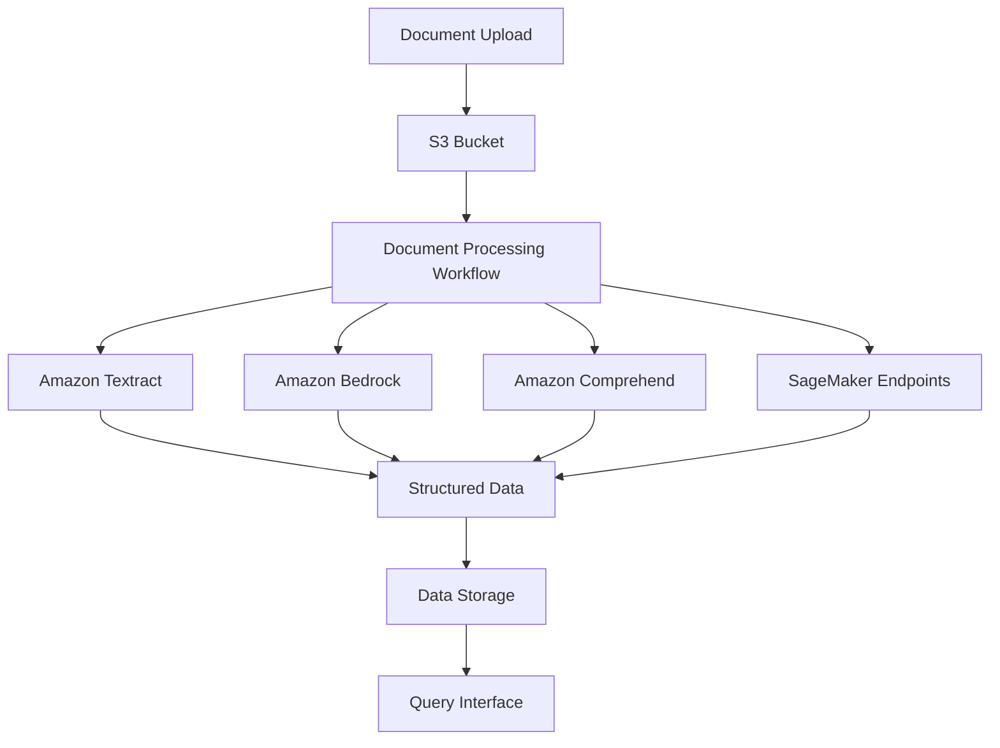

# Overview

The GenAI Intelligent Document Processing (IDP) Accelerator is a comprehensive solution for transforming unstructured documents into structured data using AWS's AI/ML services. This CDK implementation provides a modular, customizable approach to deploying the accelerator.

## Architecture

The GenAI IDP Accelerator follows a serverless architecture pattern, leveraging various AWS services to create a scalable document processing pipeline:

## Processing Patterns

The accelerator supports multiple processing patterns to accommodate different document types and extraction needs:

### BDA Processor

Uses Amazon Bedrock Data Automation for document processing with minimal custom code. Ideal for standard document types with well-defined structures.

### Bedrock LLM Processor

Implements custom extraction logic using Amazon Bedrock foundation models. Provides more flexibility for complex document formats.

### SageMaker UDOP Processor

Utilizes custom SageMaker endpoints for specialized document processing tasks, such as document classification or complex information extraction.

## Key Components

### Document Ingestion

- S3 buckets for document storage
- Event-driven processing triggers
- Document metadata tracking

### Processing Pipeline

- Step Functions workflows for orchestration
- Lambda functions for processing steps
- SQS queues for workload management

### Extraction Services

- Amazon Textract for OCR and basic extraction
- Amazon Bedrock for generative AI capabilities
- Custom SageMaker endpoints for specialized tasks

### Data Storage and Retrieval

- Document databases for structured data
- Vector stores for semantic search
- Query interfaces for data access

## Use Cases

The GenAI IDP Accelerator is designed to support a wide range of document processing use cases:

- **Financial Services**: Process loan applications, financial statements, and regulatory documents
- **Healthcare**: Extract information from medical records, insurance claims, and clinical documents
- **Legal**: Analyze contracts, legal briefs, and case documents
- **Human Resources**: Process resumes, employee records, and benefits forms
- **Supply Chain**: Extract data from invoices, purchase orders, and shipping documents

## Next Steps

- [Getting Started](../getting-started/index.md): Set up and deploy your first IDP solution
- [Developer Guides](../walkthroughs/index.md): Learn how to customize and extend the accelerator
