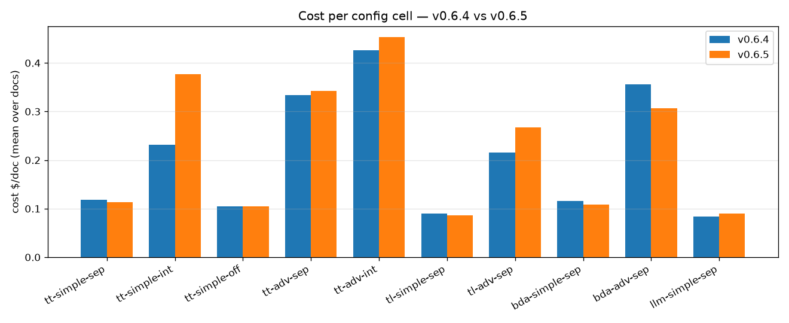
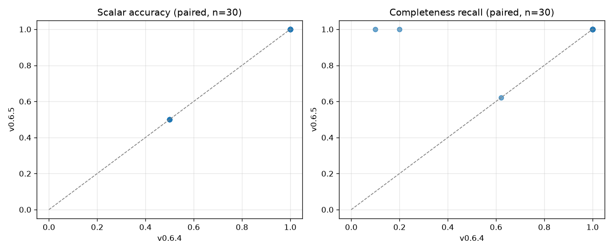

# GenAIIDP Release Benchmark — v0.6.4 (published) vs v0.6.5

**Baseline:** v0.6.4 — the previous **publicly published** release
(`https://s3.us-west-2.amazonaws.com/aws-ml-blog-us-west-2/artifacts/genai-idp/idp-main_0.6.4.yaml`,
Description `(v0.6.4)`).
**Release under test:** v0.6.5 (`develop` @ commit `720f3052a`).
**Method:** a single stack (`IDPBench065`, us-west-2, account `912625584728`) was created
from the published v0.6.4 template, benchmarked, then **upgraded in place** to v0.6.5 via
`idp-cli deploy --from-code .` and benchmarked again with **byte-for-byte identical config
files**, written verbatim to the ConfigurationTable by `compat/native_upload.py`. The only
variable between the two runs is the accelerator code version.
**Pricing:** `config_library/pricing.yaml` (sha256 `bc68d49e…`; rates as of 2026-08; intro
pricing may apply).

> Every number here is produced by `benchmarks/harness/aggregate.py` from live runs; none
> are recalled from memory. Supporting data: `benchmarks/results/v0.6.4/corefast/` and
> `benchmarks/results/v0.6.5/corefast/` (`summary.{json,csv}`, `cell_stats.csv`, and a `meta`
> block recording each side's deployed `stack_version`).

---

## TL;DR

Upgrading from the published **v0.6.4** to **v0.6.5** is **safe: nothing regressed.** It is
*not* a completeness fix — read finding 2 carefully.

1. **Accuracy is identical.** Mean scalar-field accuracy is **0.900 on both** versions, and
   every one of the 30 paired `(cell, doc)` measurements matches exactly — the paired
   scatter in §3 sits entirely on the identity line.
2. **Measured recall rose (0.931 → 0.987) but this is run-to-run variance, not a fix.** Two
   cells scored better and **none scored worse**; both improvements are single samples on
   cells whose failure mode is non-deterministic. A follow-up repeated-measures run
   (§3.1) settles it: on v0.6.5, the integrated-confidence cell that "recovered" is
   **bimodal — 2 of 4 repeats truncate the list to 10/100 rows and 2 of 4 return
   100/100**, on the same document, same config, same stack. **The
   integrated-confidence row-loss hazard is still present in v0.6.5**; the
   [v0.6.0 report](./v0.6.0.md) §4 guidance to avoid `integrated` confidence with simple
   extraction on list documents **still stands**.
3. **Cost is flat where behaviour was stable: +1.4% across the 24 runs in the 8 cells whose
   recall did not move — inside their sampling spread.** The headline total is +8.5%, but
   all of it sits in the two non-deterministic cells, where cost tracks whether that
   particular sample truncated the list. See §2.
4. **Review burden drops:** the confidence alert rate (share of confidence leaves below
   0.9) falls **10.7% → 6.4%** with accuracy unchanged, so this is a reduction in review
   volume rather than over-confidence. Also n=30, so treat it as directional.
5. **No failures on either side:** 30/30 documents completed on both versions.

`aggregate.py --compare` flags **0 cell-level regressions**. It also flags 2 cell-level
"improvements", which §3.1 shows are noise — a caution about the audit trail's own
thresholds at n=3, not about the upgrade.

---

## Methodology notes

Both sides are v0.6.x, so none of the cross-version config-compatibility handling the
[v0.6.0 A/B](./v0.6.0.md) needed was exercised here. The scoping choices below are applied
**identically to both versions**:

- **Extraction model held at Claude Sonnet 4.6** (`default_cell.extraction_model:
  sonnet46`). This is the committed cross-version control, kept here so this entry stays
  comparable with the rest of the audit trail. Both versions can run Sonnet 5; the
  cross-config study at the product default model is
  [config-guidance](../config-guidance.md), not this A/B.
- **Confidence model Nova Lite**, `reasoning_effort=low`, `geometry=ocr_only`.
- **Summarization disabled** (`summarization.enabled=false`) — it is unscored.
- **`corefast` doc set** — `tiny_form` (5 rows, 1 page), `small_narrow` (100 rows, 3 pages),
  `longdesc_100` (100 rows, 3 pages, long free-text descriptions). The same three documents
  the audit trail has used since v0.6.0, so entries remain comparable.
- **Grid:** all **10 core config cells × 3 docs = 30 runs per version**.
- **Configs written verbatim** via `--native-upload`, so the stored config bytes are
  identical on both sides rather than re-derived by a migration.

### Test data

Every document in this A/B is **synthetic, fabricated data with exact machine-generated
ground truth** — no real or externally-sourced documents were used. All three come from the
`bank_statement` generator (`benchmarks/corpus/generators/bank_statement.py`), regenerated
deterministically by `gen_corpus.py`, built from placeholder values (account
`000123456789`, fictional merchants like "AnyCompany Store") with a unique `SEQnnnnn` tag
embedded in every transaction row. That makes list recall exact (distinct SEQ tags
recovered ÷ total) and scalar accuracy exact (field-exact match against the emitted
`<doc>.truth.json`), rather than measured against a human-curated baseline.

The wider corpus also holds a synthetic scaling series (25 → 3,200 rows) and a reference set
of real labeled documents. Those are **deliberately excluded from this head-to-head** — the
audit trail's job is to isolate the code-version variable on a fixed, cheap, exactly-scored
grid. Cross-config and scaling behaviour at v0.6.5 is the subject of
[config-guidance](../config-guidance.md).

---

## 1. Per-cell summary (mean over the 3 corefast docs)

| cell (OCR · mode · assess) | $/doc v0.6.4 | $/doc v0.6.5 | Δcost | cost CV (6.4/6.5) | recall v0.6.4 | recall v0.6.5 | wall v0.6.4 | wall v0.6.5 |
|---|--:|--:|--:|--:|--:|--:|--:|--:|
| tt-simple-sep (textract+tables · simple · separate) | $0.118 | $0.113 | −4% | 0.62/0.61 | 1.000 | 1.000 | 161s | 109s |
| tt-simple-int (textract+tables · simple · integrated) | $0.231 | $0.377 | **+63%** | 0.99/0.71 | **0.700** | **1.000** | 146s | 170s |
| tt-simple-off (textract+tables · simple · off) | $0.105 | $0.105 | −0% | 0.64/0.64 | 1.000 | 1.000 | 35s | 34s |
| tt-adv-sep (textract+tables · advanced · separate) | $0.334 | $0.343 | +3% | 0.71/0.70 | 1.000 | 1.000 | 90s | 152s |
| tt-adv-int (textract+tables · advanced · integrated) | $0.426 | $0.453 | +6% | 0.72/0.76 | 1.000 | 1.000 | 107s | 116s |
| tl-simple-sep (textract+layout · simple · separate) | $0.090 | $0.087 | −3% | 0.72/0.71 | 1.000 | 1.000 | 84s | 55s |
| tl-adv-sep (textract+layout · advanced · separate) | $0.215 | $0.268 | +24% | 0.68/0.77 | 1.000 | 1.000 | 88s | 154s |
| bda-simple-sep (BDA · simple · separate) | $0.116 | $0.109 | −6% | 0.66/0.64 | 1.000 | 1.000 | 112s | 52s |
| bda-adv-sep (BDA · advanced · separate) | $0.356 | $0.306 | −14% | 0.97/0.74 | 1.000 | 1.000 | 113s | 118s |
| llm-simple-sep (Bedrock Nova OCR · simple · separate) | $0.084 | $0.090 | +7% | 0.75/0.75 | **0.607** | **0.873** | 49s | 96s |

`scalar_accuracy` is not shown per-cell because it is **identical across versions for every
cell** (§3).

**Read the cost column with the CV column.** Every cell's per-doc cost CV is 0.6–0.99 at
n=3 — the three corefast documents differ hugely in size, which is the point of the doc set
but makes a single cell's cost mean a noisy statistic. The variance-aware cell-level pass
of `aggregate.py --compare` therefore reports `tt-simple-int` (+63%) and
`tl-adv-sep` (+24%) as **inconclusive at this n**, and flags **no** cell-level cost
regression. The trustworthy cost reading is the aggregate decomposition in §2.

---

## 2. Cost — flat where nothing changed, higher only where rows were recovered

| scope | v0.6.4 | v0.6.5 | Δ |
|---|--:|--:|--:|
| **All 30 runs** | $6.223 | $6.750 | +8.5% |
| **The 24 runs in the 8 cells whose recall did not change** | $5.279 | $5.350 | **+1.4%** |
| **The 6 runs in the 2 non-deterministic cells (§3.1)** | $0.945 | $1.399 | **+48.2%** |

So the headline +8.5% is not a general cost regression: 8 of 10 cells move **+1.4% in
aggregate**, inside their sampling spread, and the entire increase is concentrated in the
two non-deterministic cells, where the sample that extracted more rows cost more:

| cell · doc | rows extracted / truth | cost |
|---|--:|--:|
| tt-simple-int · longdesc_100 | 10/100 → **100/100** | $0.135 → $0.536 |
| tt-simple-int · small_narrow | 100/100 → 100/100 | $0.493 → $0.528 |
| tt-simple-int · tiny_form | 5/5 → 5/5 | $0.066 → $0.067 |
| llm-simple-sep · tiny_form | 1/5 → **5/5** | $0.0138 → $0.0139 |

In the v0.6.5 sample `tt-simple-int` on `longdesc_100` extracted 10× the rows for ~4× the
cost. §3.1 shows both outcomes occur on v0.6.5 at roughly even odds, so read this row as
"the cost of a complete extraction vs a truncated one on the same document" rather than as a
version delta. The other two `tt-simple-int` documents, which were complete on both sides,
moved +7% and +0.2%.

Token totals across the grid (from per-doc `Metering`):

| unit | v0.6.4 | v0.6.5 | Δ |
|---|--:|--:|--:|
| input | 609,452 | 907,379 | +49% |
| output | 361,845 | 382,057 | +6% |
| cacheRead | 1,266,547 | 1,331,948 | +5% |
| cacheWrite | 173,695 | 220,908 | +27% |

The input-token rise is the mechanism behind the cost delta and has two identified
contributors, both intended v0.6.5 behaviour: the confidence pass **now attaches page
images whenever the prompt asks for them** (previously suppressed whenever
`geometry.mode` was `ocr_only` — the default — which is the fix documented in the 0.6.5
CHANGELOG, at a stated ~1.7K additional input tokens per page), and the integrated cell is
now processing ten times as many rows. Output tokens rose only 6%, consistent with the work
being *input*-side.



**⚠️ Cost note for operators:** the page-image attachment applies to any config that keeps
`{DOCUMENT_IMAGE}` in `extraction.confidence.task_prompt` (the shipped default). On
image-heavy or high-page-count corpora this is a real per-page cost increase. Removing the
placeholder from that prompt opts back into a text-only confidence pass.

---

## 3. Accuracy & completeness



- **Scalar accuracy:** mean **0.900 on both** versions; all 30 paired `(cell, doc)`
  measurements are equal, which is why the left panel is a single line of points on the
  diagonal.
- **Completeness recall:** mean **0.931 → 0.987**. In the right panel every off-diagonal
  point is **above** the line: two apparent improvements, **zero** regressions. Both are
  single samples on non-deterministic cells (§3.1) — the safe reading is "no regression",
  not "+0.057".
  - `tt-simple-int` 0.700 → 1.000 (driven by `longdesc_100`: 0.10 → 1.00) — **shown to be
    noise in §3.1**
  - `llm-simple-sep` 0.607 → 0.873 (driven by `tiny_form`: 0.20 → 1.00) — not
    independently re-measured; treat as unconfirmed
- **Confidence:** mean confidence flat (0.9287 → 0.9293), while the **alert rate**
  (share of confidence leaves below 0.9) falls **10.7% → 6.4%**. Because accuracy is
  unchanged, fewer alerts means less review for the same correctness, not a model that has
  become over-confident.
- **Failures:** 0 on both versions (30/30 completed each).

## 3.1 The integrated-confidence "improvement" is noise — the hazard is still open

The [v0.6.0 report](./v0.6.0.md) §4 recorded a regression where **simple extraction +
integrated confidence** truncated a long-description 100-row list to 10 rows, and
recommended avoiding that combination. The grid above finds the v0.6.4 stack still doing it
(10/100 rows) and the v0.6.5 stack returning all 100 — which reads like a fix.

It is not. The grid measures each `(cell, doc)` **once**, and the failure mode is a *partial
list*, not an error, so a single sample cannot separate "fixed" from "got lucky". Re-running
that exact cell 4× on v0.6.5 with a `separate`-confidence control on the same document
(`--suite intconf`, extraction model held at the same Sonnet 4.6 control) gives:

| cell | repeat | rows extracted / truth | recall | cost | wall |
|---|--:|--:|--:|--:|--:|
| tt-simple-int | 0 | 10/100 | 0.100 | $0.139 | 62s |
| tt-simple-int | 1 | 10/100 | 0.100 | $0.139 | 59s |
| tt-simple-int | 2 | **100/100** | 1.000 | $0.536 | 188s |
| tt-simple-int | 3 | **100/100** | 1.000 | $0.532 | 186s |
| tt-simple-sep | 0–3 | 100/100 ×4 | 1.000 | ~$0.159 | ~76s |

**The integrated cell is bimodal on v0.6.5 — 2 of 4 repeats truncate to exactly 10 rows —
while the `separate` control is complete 4 of 4 at a third of the cost.** The v0.6.4 → v0.6.5
"recovery" in §1/§3 was therefore a coin flip that landed differently on each side, and it
is a live demonstration that this audit trail's n=3, 1-repeat grid cannot resolve a
non-deterministic completeness failure. Two further consequences worth stating:

- **`scalar_accuracy` is 0.50 in all eight runs above, identical whether 10 or 100 rows came
  back.** The scalar fields are correct either way, so a truncated document scores the same
  as a complete one on that metric — the row loss is only visible in list recall.
- The wider v0.6.5 cross-config grid (7 synthetic docs, product-default Sonnet 5) finds the
  same hazard much **worse** at scale: mean recall **0.294**, and on an 800-row document the
  transaction list is **absent from the response entirely**. See
  [config-guidance §2](../config-guidance.md).

**Guidance unchanged and reinforced:** use **`separate`** confidence (the default) on
list-heavy documents. Do not use `integrated` with simple extraction.

Data: the `intconf` run on Sonnet 4.6 — pruned per
[`RETENTION.md`](https://github.com/aws-solutions-library-samples/accelerated-intelligent-document-processing-on-aws/blob/develop/benchmarks/results/RETENTION.md)
(one complete set per release); restore with `git checkout ec3eb05ae --
benchmarks/results/v0.6.5-intconf-sonnet46/`. Reproduce:

```bash
python3 benchmarks/harness/make_configs.py --suite intconf --class bank_statement --set extraction_model=sonnet46
AWS_PROFILE=default python3 benchmarks/harness/run_matrix.py --stack <STACK> --suite intconf --native-upload
```

---

## 4. What `--compare` flagged, and why none of it is a regression

```
REGRESSIONS (4)                 all cost-only, no accuracy/recall/failure regressions
  tt-simple-int|longdesc_100   cost +298%   ← this sample returned 100 rows, not 10 (§3.1)
  tl-adv-sep|longdesc_100      cost  +48%   ← within cell sampling spread (CV 0.68/0.77)
  bda-adv-sep|tiny_form        cost  +49%   ← $0.039→$0.058 on the 5-row doc; absolute Δ $0.019
  bda-adv-sep|small_narrow     cost  +18%   ← within cell sampling spread; cell mean is −14%
IMPROVEMENTS (2)                both single-sample; §3.1 shows the first is noise
  tt-simple-int|longdesc_100   completeness_recall +0.900
  llm-simple-sep|tiny_form     completeness_recall +0.800
CELL-LEVEL REGRESSIONS (0)
CELL-LEVEL IMPROVEMENTS (2)      ← not real; see §3.1
  tt-simple-int  recall 0.700→1.000
  llm-simple-sep recall 0.607→0.873
```

The four per-run cost flags are the row-level threshold (+15%) firing on single samples;
the variance-aware cell-level pass — the one designed to separate a real cost shift from
agentic/size noise — reports none of them as regressions, and `bda-adv-sep`'s **cell** mean
actually fell 14%.

**A gap this release exposed in the comparison tool.** `aggregate.py --compare` applies its
variance-aware treatment to **cost** but not to **completeness/accuracy**, so a
non-deterministic recall swing is promoted to a headline "CELL-LEVEL IMPROVEMENT" from a
single sample — exactly what happened here, in the direction that flatters the release.
Recall/accuracy deltas should get the same spread-aware gate as cost, or the grid needs
`repeats > 1` on the cells with known non-deterministic failure modes.

---

## 5. Reproduce

```bash
source /home/ec2-user/projects/idp1/.venv/bin/activate   # or any env with idp_common + reportlab/matplotlib
export PYTHONPATH=$PWD/lib/idp_common_pkg
AWS_PROFILE=default aws sts get-caller-identity           # confirm deployment account

# 1. deploy the PREV published release, benchmark it
idp-cli deploy --stack-name <STACK> --admin-email <you> --region us-west-2 --wait \
  --template-url https://s3.us-west-2.amazonaws.com/aws-ml-blog-us-west-2/artifacts/genai-idp/idp-main_0.6.4.yaml
python3 benchmarks/harness/gen_corpus.py
python3 benchmarks/harness/make_configs.py --suite corefast --class bank_statement
AWS_PROFILE=default python3 benchmarks/harness/run_matrix.py --stack <STACK> --suite corefast --native-upload --max-inflight 6
AWS_PROFILE=default python3 benchmarks/harness/aggregate.py --run benchmarks/results/run-<stamp> --out benchmarks/results/v0.6.4/corefast

# 2. upgrade the SAME stack in place, re-run the identical grid
idp-cli deploy --stack-name <STACK> --from-code . --region us-west-2 --wait
AWS_PROFILE=default python3 benchmarks/harness/run_matrix.py --stack <STACK> --suite corefast --native-upload --max-inflight 6
AWS_PROFILE=default python3 benchmarks/harness/aggregate.py --run benchmarks/results/run-<stamp2> --out benchmarks/results/v0.6.5/corefast

# 3. compare + charts
python3 benchmarks/harness/aggregate.py --compare benchmarks/results/v0.6.5/corefast/summary.json --baseline benchmarks/results/v0.6.4/corefast/summary.json
python3 benchmarks/harness/aggregate.py --figures-compare benchmarks/results/v0.6.5/corefast/summary.json benchmarks/results/v0.6.4/corefast/summary.json --labels v0.6.5 v0.6.4
```

**Caveats / honesty**

- Costs are estimates from `pricing.yaml` (rates as of 2026-08; intro pricing may apply).
- **n = 3 docs per cell, 1 repeat**, and the three documents differ greatly in size, so
  per-cell cost CV is 0.6–0.99. Per-cell cost deltas in §1 are therefore **not**
  individually significant; the reliable signals are the **aggregate cost decomposition**
  (§2), the **paired per-(cell,doc)** accuracy/recall (exact and stable), and the token
  totals that explain the cost movement.
- The two recall "improvements" in §1/§3 rest on **one** measurement per document. The
  `intconf` repeated-measures run (§3.1) shows the integrated-confidence one is noise; the
  `llm-simple-sep` one was **not** re-measured and should be treated as unconfirmed. The
  claim this entry stands behind is **"no regression"**, not "+0.057 recall".
- Only the `corefast` grid was run for this A/B. The scaling series and the reference
  (real, labeled) corpora were not run against v0.6.4, so this entry makes **no claim**
  about release-over-release behaviour on documents larger than 100 rows or on real-world
  corpora.
