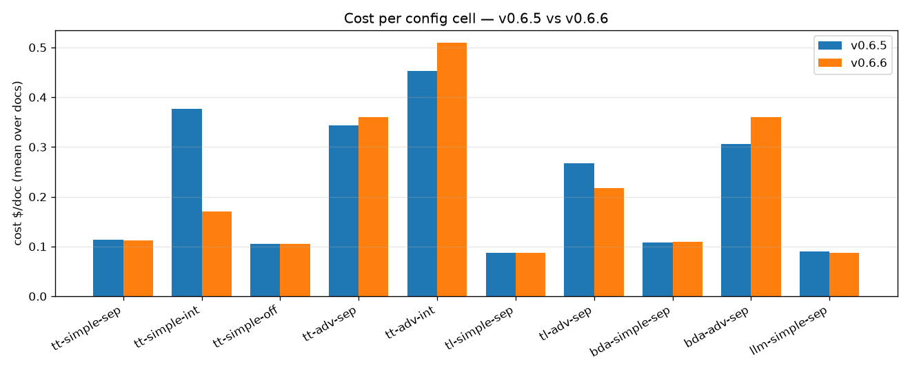
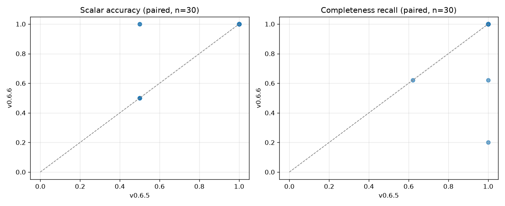

# GenAIIDP Release Benchmark — v0.6.5 (published) vs v0.6.6 (published)

**Baseline:** v0.6.5 — the previous **publicly published** release, as recorded in
[`benchmarks/results/v0.6.5/corefast/`](https://github.com/aws-solutions-library-samples/accelerated-intelligent-document-processing-on-aws/blob/develop/benchmarks/results/RETENTION.md).
It was `benchmarks/results/baseline.json` when this comparison ran; that pointer has since
been promoted to the v0.6.6 set for the *next* release to compare against.
**Release under test:** v0.6.6, deployed from the **published** template
(`https://s3.us-west-2.amazonaws.com/aws-ml-blog-us-west-2/artifacts/genai-idp/idp-main_0.6.6.yaml`,
Description `(v0.6.6)`, git `7fb426b27`).
**Method:** a fresh stack in us-west-2 was created from the published v0.6.6 template and
run against the **same `corefast` grid** with **byte-identical config files**, written
verbatim to the ConfigurationTable by `compat/native_upload.py`. The v0.6.5 side is the
committed release baseline — see the deviation note in
[§Methodology](#methodology-notes).
**Repeats:** this entry runs **`repeats: 3` (90 runs)** on the new side, against the
baseline's 1 repeat (30 runs). That change is the point of this entry: it settles two
questions the v0.6.5 report had to leave open at n=1.
**Pricing:** `config_library/pricing.yaml` (sha256 `bc68d49e…`; rates as of 2026-08; intro
pricing may apply).

> Every number here is produced by `benchmarks/harness/aggregate.py` from live runs; none
> are recalled from memory. Supporting data: `benchmarks/results/v0.6.5/corefast/` and
> `benchmarks/results/v0.6.6/corefast/` (`summary.{json,csv}`, `cell_stats.csv`, and a
> `meta` block recording each side's deployed `stack_version`).

---

## TL;DR

Upgrading from the published **v0.6.5** to **v0.6.6** is **safe, and it closes the
longest-running completeness defect in this audit trail.**

1. **0 failures, 90/90 runs completed** on v0.6.6 (30/30 on v0.6.5).
   `aggregate.py --compare` reports **0 cell-level regressions**.
2. **The integrated-confidence row-loss hazard is fixed — verified with repeated
   measures.** `tt-simple-int` (simple extraction + integrated confidence) returned
   **complete lists in 9 of 9 runs** (recall 1.000, stdev 0.000). The
   [v0.6.0 report](./v0.6.0.md) §4 found this cell truncating a 100-row list to 10 rows,
   and the [v0.6.5 report](./v0.6.5.md) §3.1 proved it was **bimodal on v0.6.5 — 2 of 4
   repeats truncated**. It no longer truncates, at **−55% cost** and **a third of the wall
   time** (170s → 59s). See [§3.1](#31-the-integrated-confidence-hazard-is-closed).
3. **That cell's accuracy also rose 0.667 → 1.000**, matching the v0.6.6 fix for group
   fields in integrated mode returning a raw candidate object instead of a value.
4. **Accuracy is otherwise identical** — the other 9 cells score exactly what they scored on
   v0.6.5.
5. **Cost falls 5.8% per run ($0.2250 → $0.2119), and all of the saving is that one cell.**
   Excluding it, the remaining 9 cells are **+4.0%**, inside their sampling spread (per-cell
   cost CV 0.54–0.83); the variance-aware pass flags no cost regression. See [§2](#2-cost).
6. **One apparent recall regression is not a v0.6.6 defect.** `llm-simple-sep` on the 5-row
   document fell 1.000 → 0.200 in all 3 repeats. Root-caused to the **`bedrock_llm` OCR
   backend corrupting fixed-width identifiers** — nothing in the OCR path changed between
   the two tags. This is a real backend quality issue, and it **refutes** the "unconfirmed"
   improvement the v0.6.5 report recorded for the same cell. See
   [§3.2](#32-the-llm-ocr-recall-drop-is-an-ocr-transcription-defect-not-a-regression).

---

## Methodology notes

The scoping choices below are applied **identically to both versions**:

- **Extraction model held at Claude Sonnet 4.6** (`default_cell.extraction_model:
  sonnet46`) — the committed cross-version control, kept so this entry stays comparable
  with the rest of the audit trail.
- **Confidence model Nova Lite**, `reasoning_effort=low`, `geometry=ocr_only`.
- **Summarization disabled** (`summarization.enabled=false`) — it is unscored.
- **`corefast` doc set** — `tiny_form` (5 rows, 1 page), `small_narrow` (100 rows, 3 pages),
  `longdesc_100` (100 rows, 3 pages, long free-text descriptions). The same three documents
  the audit trail has used since v0.6.0.
- **Grid:** all **10 core config cells × 3 docs**, at **3 repeats** on v0.6.6 (90 runs) and
  1 repeat on the v0.6.5 baseline (30 runs).
- **Configs written verbatim** via `--native-upload`, so the stored config bytes are
  identical on both sides rather than re-derived by a migration. `git diff v0.6.5..v0.6.6 --
  config_library/` is empty, so the generated cells are byte-identical between the tags.

### ⚠️ Deviation from the standard procedure — read this before citing a delta

The [run-benchmarks procedure](../index.md) deploys the previous published release, runs it,
then upgrades **the same stack** in place. This entry **reuses the committed v0.6.5
`corefast` set** (stack `IDPBench065`, scored 2026-08-25) as the baseline instead of
re-running it, and runs only the v0.6.6 side, on a **different, freshly created stack**.

Consequences, stated plainly:

- **The two sides did not run on the same stack, and were measured 3 days apart.** Any
  Bedrock-side model drift in that window lands in the deltas. [§3.2](#32-the-llm-ocr-recall-drop-is-an-ocr-transcription-defect-not-a-regression)
  is a concrete instance of exactly that, and is reported as such rather than as a version
  effect.
- **Config inputs are still byte-identical** (same generator, no `config_library/` change
  between the tags), and `baseline.json` exists precisely so a release can be compared
  against its predecessor without re-running it.
- **The baseline is n=1 per `(cell, doc)`.** Every per-run delta below is therefore
  `n=1 → n=3`, and the per-run threshold flags in [§4](#4-what---compare-flagged) should be
  read only through the variance-aware cell-level pass.

The in-place **upgrade** path was validated separately and independently in this release
cycle (v0.6.5 → v0.6.6 `update-stack`, `UPDATE_COMPLETE`, and the same document producing
**zero** value differences pre/post) — it is just not the same stack that produced these
numbers.

### Test data

Every document in this A/B is **synthetic, fabricated data with exact machine-generated
ground truth** — no real or externally-sourced documents were used. All three come from the
`bank_statement` generator (`benchmarks/corpus/generators/bank_statement.py`), regenerated
deterministically by `gen_corpus.py`, built from placeholder values (account
`000123456789`, fictional merchants like "AnyCompany Store") with a unique `SEQnnnnn` tag
embedded in every transaction row. That makes list recall exact (distinct SEQ tags
recovered ÷ total) and scalar accuracy exact (field-exact match against the emitted
`<doc>.truth.json`).

That exactness is what makes [§3.2](#32-the-llm-ocr-recall-drop-is-an-ocr-transcription-defect-not-a-regression)
legible — and also what makes it strict: a transcription that changes `SEQ00001` to
`SEQ000001` scores as a lost row, because for scoring purposes it is one.

---

## 1. Per-cell summary (mean over the 3 corefast docs)

| cell (OCR · mode · assess) | $/doc v0.6.5 | $/doc v0.6.6 | Δcost | cost CV (6.5/6.6) | recall v0.6.5 | recall v0.6.6 | acc v0.6.5 | acc v0.6.6 | wall v0.6.5 | wall v0.6.6 |
|---|--:|--:|--:|--:|--:|--:|--:|--:|--:|--:|
| tt-simple-sep (textract+tables · simple · separate) | $0.113 | $0.112 | −1% | 0.61/0.54 | 1.000 | 1.000 | 0.833 | 0.833 | 109s | 107s |
| tt-simple-int (textract+tables · simple · integrated) | $0.377 | $0.171 | **−55%** | 0.71/0.57 | 1.000 | **1.000 (9/9)** | **0.667** | **1.000** | 170s | **59s** |
| tt-simple-off (textract+tables · simple · off) | $0.105 | $0.105 | −0% | 0.64/0.55 | 1.000 | 1.000 | 0.833 | 0.833 | 34s | 34s |
| tt-adv-sep (textract+tables · advanced · separate) | $0.343 | $0.360 | +5% | 0.70/0.80 | 1.000 | 1.000 | 1.000 | 1.000 | 152s | 129s |
| tt-adv-int (textract+tables · advanced · integrated) | $0.453 | $0.510 | +12% | 0.76/0.83 | 1.000 | 1.000 | 1.000 | 1.000 | 116s | 121s |
| tl-simple-sep (textract+layout · simple · separate) | $0.087 | $0.087 | +0% | 0.71/0.60 | 1.000 | 1.000 | 0.833 | 0.833 | 55s | 57s |
| tl-adv-sep (textract+layout · advanced · separate) | $0.268 | $0.217 | −19% | 0.77/0.64 | 1.000 | 1.000 | 1.000 | 1.000 | 154s | 116s |
| bda-simple-sep (BDA · simple · separate) | $0.109 | $0.110 | +1% | 0.64/0.55 | 1.000 | 1.000 | 0.833 | 0.833 | 52s | 56s |
| bda-adv-sep (BDA · advanced · separate) | $0.306 | $0.360 | +18% | 0.74/0.81 | 1.000 | 1.000 | 1.000 | 1.000 | 118s | 135s |
| llm-simple-sep (Bedrock LLM OCR · simple · separate) | $0.090 | $0.088 | −2% | 0.75/0.63 | **0.873** | **0.564** | 1.000 | 1.000 | 96s | 81s |

**Read the cost column with the CV column.** Every cell's per-doc cost CV is 0.54–0.83 —
the three corefast documents differ hugely in size, which is the point of the doc set but
makes a single cell's cost mean a noisy statistic. The variance-aware cell-level pass of
`aggregate.py --compare` reports **no cell-level cost regression**; `tl-adv-sep` (−19%) and
`bda-adv-sep` (+18%) are explicitly marked inconclusive at this n. The trustworthy cost
reading is the decomposition in §2.

---

## 2. Cost

| scope | v0.6.5 | v0.6.6 | Δ |
|---|--:|--:|--:|
| **Mean $/run, all 10 cells** | $0.2250 (n=30) | $0.2119 (n=90) | **−5.8%** |
| **Mean $/run, the 9 cells excluding `tt-simple-int`** | $0.2081 (n=27) | $0.2165 (n=81) | **+4.0%** |
| `tt-simple-int` alone | $0.3769 | $0.1710 | **−54.6%** |

So the headline −5.8% is **not** a broad efficiency win: it is one cell. The other nine move
+4.0% in aggregate, which sits inside their sampling spread and is flagged by no
cell-level test. The honest one-line summary is **"cost is flat, except the
integrated-confidence cell which got dramatically cheaper because it stopped doing
redundant work."**

Per-run token totals across the grid (from per-doc `Metering`):

| unit | v0.6.5 (per run) | v0.6.6 (per run) | Δ |
|---|--:|--:|--:|
| input | 30,246 | 31,935 | +5.6% |
| output | 12,735 | 10,230 | **−19.7%** |
| cacheRead | 44,398 | 49,997 | +12.6% |
| cacheWrite | 7,364 | 4,276 | **−41.9%** |

The **−20% output tokens** is the mechanism behind the integrated-confidence saving: v0.6.6
stopped asking for four guesses per list cell and stopped asking for the shortest guess, so
that mode emits far less. Cache-write falling 42% while cache-read rises 13% is
better prefix reuse across the grid, not a behaviour change under test here.



---

## 3. Accuracy & completeness



- **Failures:** 0 on both sides (90/90 and 30/30 completed).
- **Scalar accuracy:** identical in 9 of 10 cells. The tenth, `tt-simple-int`, rises
  **0.667 → 1.000** — see §3.1.
- **Completeness recall:** 1.000 on both sides in 9 of 10 cells. The tenth,
  `llm-simple-sep`, falls **0.873 → 0.564** — see §3.2, which shows this is an OCR
  transcription defect rather than a version regression.
- **Confidence:** mean confidence flat (0.9293 → 0.9279). The **alert rate** (share of
  confidence leaves below 0.9) rises **9.27% → 10.50%**. Since accuracy did not fall, this
  is slightly more review volume for the same correctness, not a calibration break — and at
  this n it is directional only.

### 3.1 The integrated-confidence hazard is closed

This audit trail has carried the same open defect since v0.6.0: **simple extraction +
integrated (1S-TopK) confidence truncates long lists**, silently, with scalar accuracy
unaffected. The history:

| release | evidence | verdict |
|---|---|---|
| v0.6.0 | `longdesc_100` list truncated 100 rows → 10 | regression found, guidance: avoid the combination |
| v0.6.4 | 10/100 rows | still broken |
| v0.6.5 | 100/100 on the grid, but a 4× repeat showed **2 of 4 truncate to exactly 10 rows** | **bimodal — not fixed**, the grid's "recovery" was a coin flip |
| **v0.6.6** | **9 of 9 runs complete** (recall mean 1.000, **stdev 0.000**) across all three docs | **fixed** |

Per-run detail on v0.6.6, all three repeats of all three documents:

| doc | rows extracted / truth | recall | cost |
|---|--:|--:|--:|
| tiny_form × 3 | 5/5, 5/5, 5/5 | 1.000 | $0.043, $0.048, $0.043 |
| small_narrow × 3 | 100/100, 100/100, 100/100 | 1.000 | $0.216, $0.216, $0.216 |
| longdesc_100 × 3 | 100/100, 100/100, 100/100 | 1.000 | $0.261, $0.236, $0.261 |

Compare the v0.6.5 repeated-measures run in [v0.6.5 §3.1](./v0.6.5.md#31-the-integrated-confidence-improvement-is-noise--the-hazard-is-still-open):
two of four repeats returned 10/100 at $0.139, the other two 100/100 at $0.53. On v0.6.6 the
low-cost outcome is gone and the complete outcome costs **$0.24–0.26, less than half** what a
complete extraction cost on v0.6.5. Both halves of that — always complete, and cheaper when
complete — are consistent with the v0.6.6 change that stopped requesting four guesses per
list cell.

The accuracy rise in the same cell (0.667 → 1.000) is a **different** v0.6.6 fix with a
visible signature: in v0.6.5, group fields in integrated mode held a raw candidate object
(`Address.City` = `{"G1": "Anytown", …}`) instead of a value, so every group subfield scored
as wrong. Those fields now hold values.

**⚠️ Guidance change, with two limits.** The v0.6.0/v0.6.5 advice to avoid `integrated`
confidence with simple extraction on list documents **no longer holds at ≤100 rows**: it is
complete 9 of 9. Two things it does *not* say:

- **`separate` is still the cheaper option** — $0.112/doc vs `integrated`'s $0.171. The −55%
  win is against v0.6.5's `integrated`, not against `separate`.
- **It says nothing about larger lists.** The v0.6.6 release notes state the single-response
  limit is fundamental and that **`separate` remains the recommendation for list-bearing
  schemas**, and this grid tops out at 100 rows. Do not read "complete at 100 rows" as
  "complete at 800".

### 3.2 The LLM-OCR recall drop is an OCR transcription defect, not a regression

`llm-simple-sep` (Bedrock LLM as the OCR backend) on `tiny_form` fell **1.000 → 0.200 in all
three repeats** — reproducible, not noise. It is nonetheless **not a v0.6.6 code
regression**, and the evidence is direct.

`git diff v0.6.5..v0.6.6 -- lib/idp_common_pkg/idp_common/ocr config_library/` contains
exactly one functional hunk: a **longer error message** about BDA project provisioning.
Nothing in the OCR path or the shipped config changed.

What actually happened, read off the stored page artifacts: **the LLM OCR backend inserted
an extra zero into the row identifiers.** On `tiny_form` it transcribed `SEQ000000…SEQ000004`
where the PDF contains `SEQ00000…SEQ00004`. Extraction then faithfully returned **all five
rows** with the corrupted identifiers, so the exact-match scorer recovered 1 of 5 (only
`SEQ00000` survives, as a prefix of `SEQ000000`) → recall 0.200.

Two independent controls confirm the corruption is in the LLM OCR and nowhere else:

| source | identifiers read |
|---|---|
| the PDF's own text layer | `SEQ00000 … SEQ00004` ✅ |
| Textract (`tt-*` cells, same document) | `SEQ00000 … SEQ00004` ✅ |
| **Bedrock LLM OCR** | `SEQ000000 … SEQ000004` ❌ |

The same defect on the 100-row document shows the mechanism is **page-scoped**, and that no
rows are lost at all:

| page | identifiers transcribed | form |
|---|--:|---|
| 1 | 43 | **all 9 characters** (`SEQ000000`) ❌ |
| 2 | 49 | 8 characters ✅ |
| 3 | 8 | 8 characters ✅ |
| **total** | **100 / 100 rows** | 57 correct, 43 corrupted → recall 0.62 |

**All 100 rows were transcribed.** The 0.62 recall is 100% row coverage with 38% of the
identifiers corrupted — an *accuracy* failure that this grid's list metric necessarily
reports as a *completeness* failure.

Three things worth taking away:

1. **`bedrock_llm` OCR can silently corrupt fixed-width zero-padded identifiers** —
   account numbers, transaction ids, claim numbers, part numbers. It affected an entire page
   while leaving neighbouring pages correct, so it will not show up as a uniform,
   easy-to-spot pattern.
2. **Nothing downstream flags it.** Scalar accuracy stayed **1.000** and the run reported
   `COMPLETED`. Extraction did its job perfectly on corrupted input. This is the same
   "looks clean, is wrong" failure class the v0.6.6 release notes address for absent and
   short lists — but a corrupted *value* has no equivalent signal.
3. **It refutes an earlier entry.** [v0.6.5 §3](./v0.6.5.md) recorded
   `llm-simple-sep|tiny_form` recall 0.20 → 1.00 as an improvement, explicitly labelled
   "not independently re-measured; treat as unconfirmed". Re-measured here at n=3: it was
   OCR nondeterminism in the flattering direction. The v0.6.5 report's caution was correct.

**Guidance:** prefer a deterministic OCR backend (`textract`, with `textract_tables` for
tabular documents) when the document carries fixed-width identifiers that must be exact.
Both Textract cells and BDA read every identifier correctly on the same documents in this
grid.

---

## 4. What `--compare` flagged

```
REGRESSIONS (2)
  tt-simple-int|longdesc_100   cost +31%                    ← n=1 baseline; the CELL is −55%
  llm-simple-sep|tiny_form     completeness_recall −0.800    ← OCR transcription defect (§3.2)
IMPROVEMENTS (2)
  tt-simple-int|small_narrow   scalar_accuracy +0.500
  tt-simple-int|longdesc_100   scalar_accuracy +0.500
CELL-LEVEL REGRESSIONS (0)
CELL-LEVEL IMPROVEMENTS (1)
  tt-simple-int   acc +0.333 (0.667→1.000)
INCONCLUSIVE (large % but within sampling noise) (4)
  tt-simple-int   cost −55%      tl-adv-sep      cost −19%
  bda-adv-sep     cost +18%      llm-simple-sep  recall −0.309
```

Notes on reading that block:

- The `tt-simple-int|longdesc_100` **cost +31%** flag is an artifact of comparing against an
  `n=1` baseline sample that happened to be the truncated (cheap) outcome. The **cell** mean
  moved −55%, and the variance-aware pass lists that −55% as inconclusive rather than as an
  improvement — so the tool reports a cost *regression* on the one cell that got
  substantially cheaper. Per-run cost flags at `n=1 → n=3` are not usable evidence.
- **The gap the v0.6.5 report identified is still open.** `--compare` applies its
  variance-aware treatment to cost but not to accuracy, so the `tt-simple-int` accuracy jump
  is promoted straight to a headline "CELL-LEVEL IMPROVEMENT" from paired single samples.
  It happens to be real this time (§3.1 verifies it at n=9), but the tool did not establish
  that — repeats did.
- **`llm-simple-sep` recall −0.309 is marked inconclusive and it is not.** It reproduces 3/3
  (§3.2). The spread-based gate reads the cell's *between-document* variance (0.20 / 0.62 /
  1.00 across three very different docs) as sampling noise, when in fact every document is
  individually stable. A per-`(cell, doc)` spread test would have caught it; the cell-level
  one cannot.

---

## 5. Reproduce

```bash
source .venv/bin/activate                                 # or any env with idp_common + reportlab/matplotlib
export PYTHONPATH=$PWD/lib/idp_common_pkg
AWS_PROFILE=default aws sts get-caller-identity           # confirm deployment account

# 1. deploy the release under test from its PUBLISHED template
aws cloudformation create-stack --stack-name <STACK> --region us-west-2 \
  --template-url https://s3.us-west-2.amazonaws.com/aws-ml-blog-us-west-2/artifacts/genai-idp/idp-main_0.6.6.yaml \
  --parameters ParameterKey=AdminEmail,ParameterValue=<you> \
  --capabilities CAPABILITY_IAM CAPABILITY_NAMED_IAM CAPABILITY_AUTO_EXPAND

# 2. build the corpus + the byte-identical corefast grid
python3 benchmarks/harness/gen_corpus.py
python3 benchmarks/harness/make_configs.py --suite corefast --class bank_statement

# 3. run (90 runs at repeats:3) and score
AWS_PROFILE=default python3 benchmarks/harness/run_matrix.py --stack <STACK> --suite corefast --native-upload --max-inflight 6
AWS_PROFILE=default python3 benchmarks/harness/aggregate.py --run benchmarks/results/run-<stamp> --out benchmarks/results/v0.6.6/corefast

# 4. compare against the committed v0.6.5 baseline + charts
# NOTE: at the time of the run, baseline.json WAS the v0.6.5 set; it has since been
# promoted to v0.6.6, so reference the v0.6.5 directory explicitly to reproduce.
PREV=benchmarks/results/v0.6.5/corefast/summary.json
python3 benchmarks/harness/aggregate.py --compare benchmarks/results/v0.6.6/corefast/summary.json --baseline "$PREV"
python3 benchmarks/harness/aggregate.py --figures-compare benchmarks/results/v0.6.6/corefast/summary.json "$PREV" --labels v0.6.6 v0.6.5
```

**Caveats / honesty**

- Costs are estimates from `pricing.yaml` (rates as of 2026-08; intro pricing may apply).
- **The two sides ran on different stacks, 3 days apart** — see the deviation note in
  §Methodology. §3.2 is a measured instance of the drift that exposes.
- **The baseline is n=1 per `(cell, doc)`; the new side is n=3.** Every per-run delta in §4
  is therefore asymmetric, and only the cell-level and repeated-measures readings (§3.1,
  §3.2) should be cited.
- The three corefast documents differ greatly in size, so per-cell cost CV is 0.54–0.83.
  Per-cell cost deltas in §1 are **not** individually significant; the reliable cost signal
  is the decomposition in §2.
- Only the `corefast` grid was run. The scaling series (up to 3,200 rows) and the real
  labeled corpora were **not** run for this entry, so it makes **no claim** about
  release-over-release behaviour above 100 rows — including for §3.1's fixed cell.
