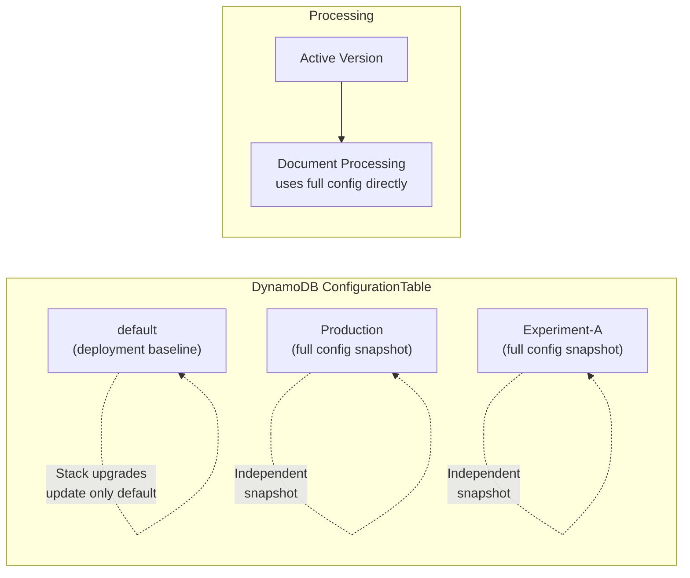

Copyright Amazon.com, Inc. or its affiliates. All Rights Reserved.
SPDX-License-Identifier: MIT-0

# Configuration Profiles

Configuration Profiles enable you to manage multiple named configurations for your
IDP solution, track which configuration was used for each document processed, and
compare results across configurations — all without redeploying your stack. Each
profile keeps a **revision history**, so saving a change never loses the
configuration it replaced.

> This page used to be called *Configuration Versions*, and "version" meant the
> named entity itself — which made the history of one configuration impossible to
> talk about ("versions of a config version"). See
> [Terminology](#terminology-which-word-means-what) for the vocabulary that
> replaced it.
>
> API and stored field names are unchanged for compatibility —
> `getConfigVersions`, `versionName`, `ConfigVersion`, and
> `allowedConfigVersions` all still refer to **profiles**.
>
> The CLI and SDK now accept the new name as well: `--config-profile` /
> `config_profile=` alongside `--config-version` / `config_version=`. Both
> spellings set the same value; "version" is kept for backward compatibility and
> is not going away, but "profile" is the name to use in new scripts.


https://github.com/user-attachments/assets/c67e38ad-4fe1-49ec-91ff-229787e43766


## Terminology: which word means what

Four things in this product keep a history, and they do not all use the same word.
This is the whole vocabulary in one place:

| Term | Belongs to | What it is |
|---|---|---|
| **Configuration Profile** (UI: "Profile") | — | The named configuration entity: `default`, `Production`, `lending`. The access-control unit (`allowedConfigVersions`), the document-visibility partition, and what you activate. |
| **Configuration** | a profile | The content itself: OCR/classification/extraction settings, document classes, prompts. What the editor form edits. |
| **Revision** (`r7`) | a profile | An immutable numbered snapshot of one profile's *configuration*, cut on every save. See [Revision History](#revision-history). |
| **Version** | a document, a test set | An immutable numbered snapshot produced by an *event* — a processing run completing ([document versions](document-versions.md)) or someone publishing a test set ([test sets](test-studio.md)). |
| **Edit history** | an extracted value or a label | A log of field-level edits someone made, with who and when. Not numbered, not a snapshot. Surfaced as the **Edit history** tab. |

Why two words for what looks like the same idea: a *version* is a snapshot an event
produced and is identified by what happened (a run id, a publish number); a
*revision* is a snapshot of content somebody authored and saved. The practical
reason is plainer, and worth stating rather than dressing up — "version" is already
baked into the public API (`listDocumentVersions`, `publishTestSetVersion`,
`TestSetVersion`) and into stored DynamoDB keys (`version#000001`), so renaming it
for symmetry would mean a data migration and a breaking API change with no benefit
to anyone using the product.

The rule that keeps this stable: **the noun that owns the snapshot picks the word.**
Documents and test sets have versions. Configuration profiles have revisions. Values
and labels have an edit history.


https://github.com/user-attachments/assets/b1e0cf16-d2c4-4927-a9ec-767b8ac49c9d


## Overview

Each configuration version is a **complete, self-contained configuration snapshot**. When you create or edit a version, the full configuration is saved — there is no hidden merging or delta logic. This makes behavior predictable and debuggable: what you save is exactly what gets used at runtime.



### Key Concepts

- **Profiles are independent snapshots**: Each profile stores a complete configuration. Editing one profile has no effect on others.
- **Every save cuts a revision**: The configuration you replace is retained as an immutable revision you can view, compare, and restore. Saving is therefore non-destructive.
- **The `default` profile** is the deployment baseline created and updated by CloudFormation/CDK during stack deployments.
- **Active profile**: One profile is marked as "active" at any time. New document processing uses the active profile unless overridden.
- **What you save is what you get**: No hidden merge transforms. The configuration stored in DynamoDB is the configuration used at runtime.
- **Stack upgrades update only `default`**: When you upgrade the solution, only the `default` profile receives new settings — as a new revision, so you can diff what the upgrade changed. Your other profiles remain untouched as locked snapshots that you explicitly manage.

### Managed vs Custom Versions

Configuration versions fall into two categories, indicated by a **Type** badge in the versions table:

| Type | Badge | Description |
|------|-------|-------------|
| **Managed** | 🔵 Blue | Stack-deployed versions that ship with the solution (e.g., `fake-w2`, `docsplit`, `ocr-benchmark`, `realkie-fcc-verified`). Each corresponds to a pre-deployed test set. |
| **Custom** | ⚪ Grey | User-created versions — fully editable and under your control. |

**Managed versions** have special protections:

- **Overwritten on stack updates** — always reflect the latest defaults shipped with the solution
- **Save disabled** — the "Save changes" button is disabled and an info banner explains the config is stack-managed
- **Delete disabled** — managed versions cannot be deleted in the UI or via the API
- **Editable copies** — use **Create profile** to create a custom, editable copy from any managed profile
- **Test Studio integration** — when a test set is selected in Test Studio, the matching managed config version is auto-selected

> **Tip:** To customize a managed configuration, click **Create profile** in the Configuration Profiles table and copy the managed profile into a new one. The original managed profile remains untouched and will continue to be updated with solution upgrades. If you have already made edits in the editor against the managed profile, use **Actions → Save current edits as new profile…** instead so those edits come along.

For full details on managed configuration deployment and the config library, see [Configuration — Managed Configuration Versions](configuration.md#managed-configuration-versions).

### Use Cases

- **A/B testing**: Compare extraction accuracy across different model or prompt configurations
- **Environment separation**: Maintain `Production`, `Staging`, and `Experiment` versions within a single stack
- **Iterative tuning**: Save each prompt-engineering iteration into the same profile — every save is a revision you can diff and roll back to, so you no longer need a new profile name per attempt
- **Safe rollback**: Keep a known-good version active while experimenting with a new one

## Revision History

Every save of a profile's configuration records an immutable **revision**. This is
what makes an in-place save safe: the configuration you just replaced is still
there.

### Why revisions exist

Before revisions, the only way to keep a previous configuration was to create a
new profile name (`usecaseA_v1`, `usecaseA_v2`, …). Every such name is a separate
access-control object an admin has to grant to each scoped user, so iterating on a
configuration meant either destroying the previous one or asking an admin for a new
name. Revisions give that lineage a home that is **not** an access-control object.

The rule worth remembering: **revisions are content; profiles are access-control
objects.** An Author scoped to a profile can move its content freely; only an Admin
can create a new profile.

### Viewing history

In the **Configuration Profiles** table, the **History** column shows how many
revisions a profile has. Click it to open **Configuration revisions**, listing every
retained revision newest-first with who saved it and when. The same panel is
reachable from **Actions → Configuration revisions…** while you have a profile open
in the editor, which is where you are standing when you want to undo a save.

From the panel you can:

- **Compare any two revisions** — select two rows and choose *Compare revisions*
  for the same field-by-field diff used to compare profiles, including the
  word-level inline diff that makes prompt edits easy to read. (The profiles table's
  *Compare profiles* button is the other axis: across profiles rather than within
  one.)
- **Restore an earlier revision** — Admin or Author. Restoring is **forward-only**:
  the restored configuration is saved as a *new* revision, so the configuration it
  replaced remains in the history and can itself be restored. History is never
  rewritten.
- **Label a revision** — mark a revision (e.g. `known good`). A labeled revision is
  exempt from retention pruning; labeling is how you say "keep this one".
- **Delete a revision** (Admin only) — permanently removes that revision's stored
  configuration. The current revision cannot be deleted.

### What a revision records

| Field | Meaning |
|---|---|
| **Revision** | Sequential number (`r7`), allocated atomically so two simultaneous saves never collide |
| **Saved** / **By** | When it was cut and which user saved it (`stack-deployment` for a CloudFormation deploy) |
| **Notes** | What the save was — e.g. *Reset to default*, *Restored from r3*, *Updated by stack deployment* |
| **Label** | Optional user marker; also protects the revision from pruning |
| **Current** badge | The revision the profile's configuration currently reflects |
| **Pinned** badge | Referenced by a test run, so retention keeps it and the run stays comparable |

### A save that changes nothing records nothing

Saving a profile whose configuration is byte-for-byte unchanged does not create a
revision. This matters because every stack deployment re-saves `default` and each
managed profile whether or not the shipped configuration moved — without this, a
handful of upgrades would fill the retention window with identical revisions and
push your real history out of it.

### Selecting a revision for processing or testing

By default everything runs under a profile's **current** revision. Wherever a
profile is chosen you can instead pin an earlier one:

| Surface | Behavior |
|---|---|
| **Test Executions** | Profile picker plus a **Configuration revision** picker. Pinning is how two runs of the same profile stay comparable — the run records which revision produced its numbers. |
| **Upload Documents** | Pin a revision for the documents being uploaded. |
| **Reprocess Document** | Pin a revision to reproduce what an earlier run produced. |
| **Generate draft labels** | Pin the revision that drafts the labels. |
| **CLI / SDK** | `--config-revision 7` alongside `--config-profile` on `process` / `run-inference` (`config_revision=` on `batch.process`). |

The revision picker appears only when the profile actually has history — a
dropdown whose only entry is "Current" is noise rather than a choice.

### Revisions from the CLI and SDK

Everything above is also reachable programmatically, which is what lets an
automated loop keep **one** profile and track its attempts as revisions:

| Task | CLI | SDK |
|---|---|---|
| Save, and learn which revision it became | `config-upload` prints `Revision: r7` | `upload()` returns `revision` |
| Say what the change was | `config-upload --revision-notes "raised topK to 20"` | `upload(revision_notes=...)` |
| See a profile's history | `config-revisions --config-profile lending` (`--json` for scripting) | `revisions(config_profile=...)` |
| See each profile's current revision | `config-list` (`Rev` column) | `list()` → `published_revision` |
| Fetch what an earlier run used | `config-download --config-profile lending --config-revision 7` | `download(config_profile=..., config_revision=7)` |
| Process / score under an exact revision | `--config-revision 7` on `process` / `run-inference` | `config_revision=7` on `batch.process` |

```bash
# Upload attempt N, capture the revision it became, and score exactly that
rev=$(idp-cli config-upload --stack-name my-stack --config-file attempt.yaml \
        --config-profile tuning-run-42 --version-description "raised topK to 20" \
      | sed -n 's/^Revision: r//p')

idp-cli run-inference --stack-name my-stack --test-set my-tests \
    --config-profile tuning-run-42 --config-revision "$rev" --monitor
```

Requesting a revision that retention has already pruned **fails** rather than
falling back to the profile's current configuration: substituting a different
configuration under the name you asked for would look like a success, and its
numbers would go into a comparison. Label or pin the revisions you need to keep.

Naming a new profile per attempt also works and predates revisions, but every one
of those profiles then appears in the profile pickers and `allowedConfigVersions`
scope lists of the whole deployment.

**Every document is pinned, whether or not you chose a revision.** The queue
processor stamps the profile's current revision onto the document as it starts. So
a save made while a document is in flight cannot change the configuration
underneath it — without that, extraction could run under r7 and assessment under
r8, and the result would correspond to no single configuration. The pinned
revision is recorded as `ConfigRevision` on the document and shown next to the
configuration profile in the document list, document details, and exports.

A pinned revision that has been deleted or pruned **fails the step** rather than
falling back to the profile's current configuration: a run that silently used the
wrong configuration would look successful, and its numbers would go into a
comparison. Retention protects any revision a test run pinned (below), so this
only arises after an explicit delete.

### Test Studio: comparing two revisions of one profile

Run the same test set twice, pinning a different revision each time. Each run
records both its **configuration revision** and the **test-set version** it scored
against, so a metric difference between two runs is attributable rather than
ambiguous:

| Both runs | A metric difference means |
|---|---|
| Same test-set version, different config revision | The configuration change moved it |
| Same config revision, different test-set version | The ground truth moved |
| Both differ | Nothing conclusive — re-run holding one fixed |

The revision appears in the test-run list, the results view, the comparison view,
and CSV/JSON exports. Pinning a revision in a run also marks it exempt from
retention pruning, so the comparison stays readable later.

> **Confidence curves are not keyed per revision.** Test Studio's review-effort
> estimate rests on a confidence→accuracy curve, because confidence means
> different things across models and prompts. Revisions of one profile share a
> curve — right for a prompt tweak, wrong after a model swap. So **after changing a
> profile's extraction model or assessment configuration, treat the review-effort
> estimate for test sets using that profile as unreliable until fresh observations
> accumulate.** Each revision records a **confidence fingerprint** (a hash of the
> confidence-relevant configuration) that a future release will key curves on. See
> the fuller note in
> [Test Studio](./test-studio.md#the-curve-is-measured-and-it-improves), which
> also covers a separate limitation on the reading side.

### Retention

The last **20** revisions per profile are retained by default, plus — regardless of
that limit — the current revision, any labeled revision, and any revision pinned by
a test run. Older unprotected revisions are pruned automatically as new ones are
cut. The limit is set by the `CONFIG_REVISION_CAP` environment variable on the
configuration resolver and the configuration custom-resource Lambda.

Revision bodies are stored in the Configuration bucket under
`config_revisions/<profile>/<nnnnnn>.json.gz`, with a small metadata index in the
`ConfigurationTable`. Keeping the bodies out of the table is deliberate: listing
profiles scans that table, and DynamoDB bills a scan on full item size, so storing
revision bodies there would make the profile list more expensive with every save.

### First save after upgrading

A profile that already existed before this feature has no history yet. On its first
save after the upgrade, the configuration that was there **before** that save is
cut as its first revision — so enabling history does not lose the state history was
introduced to protect. Profiles never saved after the upgrade simply show no
revisions.

## Managing Profiles via Web UI

### Configuration Profiles Table

The **View/Edit Configuration** page includes a Configuration Profiles table that lists all profiles with:

| Column | Description |
|--------|-------------|
| **Profile Name** | Unique identifier (e.g., `default`, `Production`, `lending`) — click to open in editor |
| **Type** | Badges showing **Managed** (blue) or **Custom** (grey), plus **Active** (green) if applicable. Sortable. |
| **Description** | Optional description (max 200 characters) |
| **Updated** | Timestamp of the last modification |
| **History** | Number of retained revisions — click to open the revision history |

**Created** is available in the preferences gear but hidden by default: two
timestamps cost a column for something **Updated** already answers, and the table
sits above the configuration editor, so every column it does not need is vertical
space taken from the thing you came to edit.

The table includes a **type filter** (All / Managed / Custom) and a **preferences gear** to configure page size and visible columns.

#### Available Actions

- **Open/Edit**: Click a version name to open it in the configuration editor
- **Create profile**: Create a new profile as a copy of an existing one. Pick the source profile (prefilled with the checked row, or the profile currently open in the editor), give the copy a name and optional description, and the new profile is created and opened in the editor. The source profile is not modified. This is the normal way to get an editable copy of the stack-managed `default`.
- **Create (Import)**: Import a configuration file (JSON/YAML) or from the Configuration Library as a new version
- **Activate**: Set a selected version as the active version for processing
- **Compare**: Select 2+ versions to view a side-by-side diff (exportable as CSV/JSON)
- **Delete**: Remove selected versions (cannot delete the active version, `default`, or managed versions); a confirmation dialog lists the affected versions before deletion

> The versions table uses standard checkboxes for row selection. Managed/Custom/Active badges show a short description of what each means on hover.

### Editing a Version

When you open a version in the configuration editor:

1. The full configuration is loaded and displayed in the form editor
2. Fields that differ from the current `default` are visually highlighted
3. You can edit any setting — classification, extraction, models, prompts, document classes, etc.
4. Click **Save changes** to persist the full updated configuration

#### Unsaved Changes Indicator

- Individual fields with unsaved edits display an **orange dot** (●) next to the field label
- An **info banner** appears at the top: *"You have unsaved changes. Click Save changes to persist, or Discard changes to revert."* — this appears for **all** profiles, including the stack-managed `default` (where the banner instead points you to **Save as Profile**, since Save changes is disabled)
- The **Discard changes** button reloads the last-saved configuration from the server
- A successful save (or Save as Profile / Reset to Default) also shows a brief **success toast** in the top-right notification area, visible even when scrolled deep in a long form

#### Browser Navigation Guard

The editor protects against accidental data loss:
- **Browser close/refresh**: The browser's native `beforeunload` dialog warns you before leaving
- **SPA navigation**: Navigating to another page within the app triggers a confirmation dialog when unsaved changes exist

### Special Operations

| Operation | What It Does |
|-----------|-------------|
| **Save changes** | Saves the current form as the full configuration for this version |
| **Save current edits as new profile** | (Actions menu) Saves the configuration **as it currently stands in the editor**, including unsaved edits, to a new profile; the open profile is left unchanged. Use this to keep in-progress edits — including edits made to a read-only managed profile. To copy a profile's last *saved* state instead, use **Create profile** in the profiles table. |
| **Save as Default** | Copies this version's configuration to become the new `default`, then resets the version to match |
| **Reset to Default** | Copies the current `default` configuration into this version, replacing all customizations |
| **Restore field** | (Per-field) Resets an individual field to its value in the `default` version |

### Version Comparison

Select two or more versions using the checkboxes, then click **Compare Selected**:

- A modal displays all settings that differ between the selected versions
- Differences are shown field-by-field with each version's full value in its own column (long values scroll rather than truncate)
- When exactly **two** versions are compared, each differing value is rendered as a word-level inline diff — added text is highlighted green and removed text red — making prompt and description edits easy to spot
- Export the comparison as **CSV** or **JSON** for offline review

### Export and Import

#### Export
- Click **Export** to download the currently open version as a JSON or YAML file
- The export contains the complete configuration — it can be imported into another stack or version

#### Import as New Version
- From the Versions Table, click **Import** to create a new version from a file
- Provide a unique version name and optional description
- The imported configuration becomes a new independent version

## Managing Profiles via CLI

The IDP CLI supports full configuration version management. See [idp-cli.md](idp-cli.md) for complete command reference.

### Download a Specific Version

```bash
# Download the active version
idp-cli config-download --stack-name my-stack --output config.yaml

# Download a specific version
idp-cli config-download --stack-name my-stack --config-profile Production --output config.yaml
```

### Upload / Create a Version

```bash
# Upload to the active version
idp-cli config-upload --stack-name my-stack --config-file ./config.yaml

# Update an existing version
idp-cli config-upload --stack-name my-stack --config-file ./config.yaml \
    --config-profile Production

# Create a new version with description
idp-cli config-upload --stack-name my-stack --config-file ./config.yaml \
    --config-profile Experiment-A \
    --version-description "Testing nova-2-lite for extraction"
```

### Process Documents with a Specific Version

```bash
# Process with a specific configuration profile
idp-cli run-inference --stack-name my-stack --dir ./documents/ \
    --config-profile Production --monitor

# Pin an exact revision of that profile (reproduces what r7 recorded)
idp-cli process --stack-name my-stack --dir ./documents/ \
    --config-profile Production --config-revision 7 --monitor

# Process test set with version and context
idp-cli run-inference --stack-name my-stack --test-set fcc-example-test \
    --config-profile Experiment-A \
    --context "Testing nova-2-lite extraction prompts" \
    --monitor
```

The `--config-profile` parameter (`--config-version` is the former name and
still works):
1. Validates the profile exists before starting processing
2. Stores the profile name as S3 object metadata (`config-version`) on uploaded documents
3. The processing pipeline reads and uses the specified profile's configuration

`--config-revision` travels the same way, as `config-revision` object metadata. Omit
it and the queue processor pins the profile's current revision instead.

## Profile Tracking in Document Processing

### How Version Is Tracked

When a document is processed, the configuration version used is recorded:

1. **S3 Metadata**: The config version is stored as object metadata on the document in S3
2. **DynamoDB**: The `ConfigVersion` attribute is saved with the document tracking record
3. **UI Display**: The config version appears in the Document List table, Document Details panel, and all export formats

### Version Selector in Processing UIs

A **Configuration Version** dropdown is available in:

- **Upload Documents** panel — select which version to use when uploading new documents
- **Reprocess Document** modal — select which version to use when reprocessing
- **Discovery** panel — select which version to save discovered schemas to

The dropdown shows all available versions with their descriptions, and indicates which is currently active.

## Test Studio Integration

The Test Studio fully supports configuration versions for systematic benchmarking:

### Running Tests with Versions
1. In the **Test Executions** tab, select a test set
2. Choose a **Configuration Version** from the dropdown
3. Optionally add a context description
4. Click **Run Test**

### Version Tracking in Results
- Each test run records the configuration version used
- The **Config Version** column appears in the test runs list (clickable link to the configuration page)
- The test results detail view displays the config version prominently
- The test comparison view includes config version for each compared run

### Export with Version Data
- **CSV export**: Includes a `Config Version` column with the version name
- **JSON export**: Includes `configVersion` field in each test run record
- **Print view**: Config version displayed in the results header

## Storage Architecture

### DynamoDB Key Format

Configuration versions are stored in the `ConfigurationTable` DynamoDB table:

| Partition Key (`Configuration`) | Description |
|------|-------------|
| `Config#default` | Deployment baseline (updated by stack deployments) |
| `Config#Production` | User-created profile named "Production" |
| `Config#lending` | User-created profile named "lending" |
| `ConfigRevIndex#lending` | Revision metadata index for the `lending` profile |
| `Config#__active` | Sentinel pointing at the active profile (reserved; not a profile) |

The `Config#__active` sentinel exists so resolving the active profile at document-queue
time is a single `get_item` rather than a scan of every profile. `__active` is a
reserved name and cannot be used for a profile.

### Item Structure

Each version item contains metadata as top-level DynamoDB attributes, plus the configuration data stored as a gzip-compressed Binary attribute:

| Field | Type | Description |
|-------|------|-------------|
| `Configuration` | String | Partition key (`Config#<versionName>`) |
| `IsActive` | Boolean | Whether this is the active version |
| `Description` | String | Optional version description |
| `CreatedAt` | String | ISO 8601 creation timestamp |
| `UpdatedAt` | String | ISO 8601 last-modified timestamp |
| `_compressed_config` | Binary | Gzip-compressed JSON containing all configuration data |
| `_config_storage` | String | Set to `"compressed"` for compressed format |
| `LatestRevision` | Number | Highest revision number cut for this profile |
| `PublishedRevision` | Number | Revision the profile's configuration currently reflects |

### Compressed Storage

Configuration data (ocr, classification, extraction, classes, assessment, summarization, etc.) is gzip-compressed into a single DynamoDB Binary attribute. This overcomes DynamoDB's 400KB item size limit, supporting configurations with **3,000+ document classes**.

- **Write path**: Config data is serialized to JSON and gzip-compressed (achieving 37-95x compression ratios for typical JSON Schema configurations)
- **Read path**: Compressed items are auto-detected via the `_config_storage: "compressed"` marker and transparently decompressed
- **Backward compatibility**: Legacy uncompressed items (from older versions) are read as-is — no migration steps needed. On the next write, the config is automatically stored in compressed format.

### Full Config Format

New-format configuration versions include a `_config_format: "full"` marker. This distinguishes them from legacy sparse-delta configs. The detection logic (`_is_full_config()`) checks for:
1. Explicit `_config_format: "full"` marker (new format), OR
2. Presence of ≥4 top-level config sections (heuristic for pre-marker full configs)

### Legacy Sparse Config Migration

If you have existing configurations from before this feature:
- **Auto-detection**: Legacy sparse configs (only containing deltas from default) are automatically detected
- **Auto-migration**: On first read, sparse configs are merged with the `default` version and the full result is saved back with the `_config_format: "full"` marker
- **Transparent**: No manual intervention required — the migration happens seamlessly on first access

## GraphQL API Reference

### Queries

| Query | Parameters | Description |
|-------|-----------|-------------|
| `getConfigVersions` | *(none)* | Returns list of all profiles with metadata (name, isActive, timestamps, description, revision counters) |
| `getConfigVersion` | `versionName: String!` | Returns the full configuration for a specific profile |
| `listConfigProfileRevisions` | `profileName: String!` | Returns the profile's revision history, newest first |
| `getConfigProfileRevision` | `profileName: String!`, `revision: Int!` | Returns the full configuration recorded in one revision |

### Mutations

| Mutation | Parameters | Description |
|----------|-----------|-------------|
| `updateConfiguration` | `input: AWSJSON!, versionName: String, description: String` | Update a version's configuration. Supports flags: `saveAsVersion`, `saveAsDefault`, `resetToDefault` |
| `setActiveVersion` | `versionName: String!` | Activate a specific version (deactivates all others) |
| `deleteConfigVersion` | `versionName: String!` | Delete a profile and its revision history (fails if active or `default`) |
| `restoreConfigProfileRevision` | `profileName: String!`, `revision: Int!` | Save an earlier revision as the profile's current configuration (as a new revision) |
| `labelConfigProfileRevision` | `profileName: String!`, `revision: Int!`, `label: String`, `notes: String` | Label a revision (also exempts it from pruning) |
| `deleteConfigProfileRevision` | `profileName: String!`, `revision: Int!` | Delete one revision (Admin only; cannot delete the current one) |

All revision operations are scope-checked at the **profile**: a revision is content
inside a profile, never its own access-control object. See [RBAC](rbac.md).

## Upgrade Considerations

### Stack Upgrades and Version Independence

When you upgrade the IDP solution to a new version:

1. **`default` profile is updated** with new settings, prompts, or model defaults from the deployment — recorded as a new revision, so `default` r(n-1) → r(n) is a diff of exactly what the upgrade changed
2. **All other profiles remain unchanged** — they are locked snapshots
3. **Trade-off**: New default features (e.g., improved prompts, new model options) do NOT automatically propagate to existing profiles
4. **Rollback**: If an upgrade's configuration changes are unwanted, restore the previous revision of `default` from its revision history

### Managing Divergence

To incorporate new defaults into an existing version:
- **Reset to Default**: Copy the entire current default into your version (replaces all customizations)
- **Manual review**: Open your version alongside the default, compare differences, and selectively update fields
- **UI diff highlighting**: Fields in your version that differ from the current default are visually highlighted, making it easy to spot divergence

### Best Practices

1. **Export before upgrading**: Use the Export button to download your active profile's configuration before a stack upgrade (revision history also covers you, but an export is portable across stacks)
2. **Review default changes**: After upgrading, compare your version with the updated default to identify beneficial new settings
3. **Profile naming**: Name profiles after the use case or environment they serve (e.g., `lending`, `production`, `experiment-nova2-lite`). You no longer need to encode iterations in the name (`usecaseA_v1`, `usecaseA_v2`) — that is what revisions are for
4. **Document context**: Use version descriptions and test run context fields to record what each version is testing
