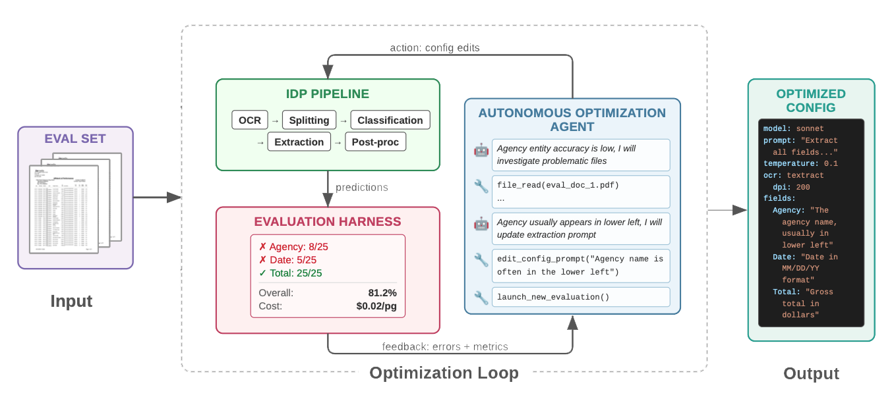

# Auto Optimizer (Beta)

The **Auto Optimizer** is a fully autonomous AI agentic system that optimizes your document processing configuration — no manual prompt engineering or technical expertise required. It performs the same work a human expert would do manually over days or weeks, but fully autonomously in just a few hours.

## Demo Video

#### Non Technical

**Duration**: ~1.5 minutes

https://github.com/user-attachments/assets/57f70099-0909-4d13-ba8e-7f365b63eaa8

#### Technical

**Duration**: ~3.5 minutes

https://github.com/user-attachments/assets/981ae354-bb5d-4613-bf01-ac17675be25b

## What it does

You provide:
- A labeled dataset (as few as 5 documents)
- A cost-per-page budget reflecting your business requirements

The Auto Optimizer handles the rest. It iteratively runs experiments to refine:
- Extraction and classification prompts
- Model selection
- Processing pipeline configurations
- Formatting instructions

The agent is equipped with curated, expert-authored domain knowledge about the IDP system, enabling informed optimization decisions rather than blind trial-and-error.

## How it works

1. **Dataset exploration** — The agent examines both ground truth labels and document images using a multimodal model to understand your document types.
2. **Baseline creation** — It determines the document classes present and creates an initial IDP configuration.
3. **Iterative optimization** — The agent inferences the test set, downloads results, identifies poorly performing classes and documents, performs prompt engineering and pipeline reconfigurations, and evaluates again.
4. **Convergence** — After multiple iterations, it recommends the best configuration found within your cost budget.

Throughout the process, the agent produces:
- A **live stream** of its reasoning and actions, visible in the UI in real time
- A succinct **markdown optimization log**
- A structured **final report** showing all experiments tried and which configuration it recommends

## Scientific validation

The Auto Optimizer system is scientifically validated in [this paper submitted to the 2026 Conference on Empirical Methods in Natural Language Processing (EMNLP)](https://arxiv.org/abs/2607.26075). In controlled experiments it surpassed human expert accuracy on multiple real-world document datasets, and those improvements generalize to unseen documents with no overfitting.

## Availability

The Auto Optimizer is a paid extension to the IDP Accelerator, available as a subscription on [AWS Marketplace](https://aws.amazon.com/marketplace/pp/prodview-44jb64lvdxr3y). It is in **beta**: subscribing means accepting the beta licence terms shown on the listing, and it is labelled **Auto Optimizer (Beta)** in the IDP web UI until it reaches general availability.

It is published for the same Regions as the accelerator's own templates — **us-east-1**, **us-west-2**, and **eu-central-1**. Your IDP Accelerator stack has to run in one of them; an extension page in any other Region says so instead of offering an install.

Once installed, it appears under **Extensions** in the IDP web UI navigation.

## Starting an optimization run

From the Auto Optimizer page in the UI:

1. **Test set** — Select a labeled dataset you've uploaded to the IDP accelerator
2. **Max cost per page** — The cost-per-page budget your business can afford (e.g., $0.03/page)
3. **Max optimization cost** — A cap on total spend for this optimization run
4. **Max iterations** — Number of experiment iterations the agent should complete
5. **Starting config** (optional) — An existing configuration to start from, or leave empty to start from scratch
6. **Guidance** (optional) — Free-text instructions to steer the agent

Once started, the agent streams its progress live to the UI. You are free to log out — the agent continues running autonomously.

## Getting access

1. **Deploy the IDP Accelerator** if you haven't already — the extension installs into a host stack you run, so it has nothing to attach to on its own. See [Quick Start](../quick-start.md).
2. **Subscribe on [AWS Marketplace](https://aws.amazon.com/marketplace/pp/prodview-44jb64lvdxr3y)**, where you accept pricing, the beta licence terms, and the AWS Customer Agreement. Subscribe with the same AWS account your IDP Accelerator stack runs in — a subscription held by another account in your organization isn't visible to a member account's stack.
3. **Install it from the IDP web UI.** Sign in as an `Admin`, open **Auto Optimizer (Beta)** under **Extensions**, and choose **Launch Stack**. Full walkthrough: [After Subscribing on AWS Marketplace](../marketplace-subscription-next-steps.md).

https://github.com/user-attachments/assets/5a3345ce-f52f-44de-993d-a3b1efae0aad

Manage or cancel the subscription any time from the [AWS Marketplace subscriptions console](https://console.aws.amazon.com/marketplace/home#/subscriptions). Cancelling does not delete the extension's CloudFormation stack — delete that separately if you want its resources removed.

For questions about the beta, reach out to your AWS account team.
