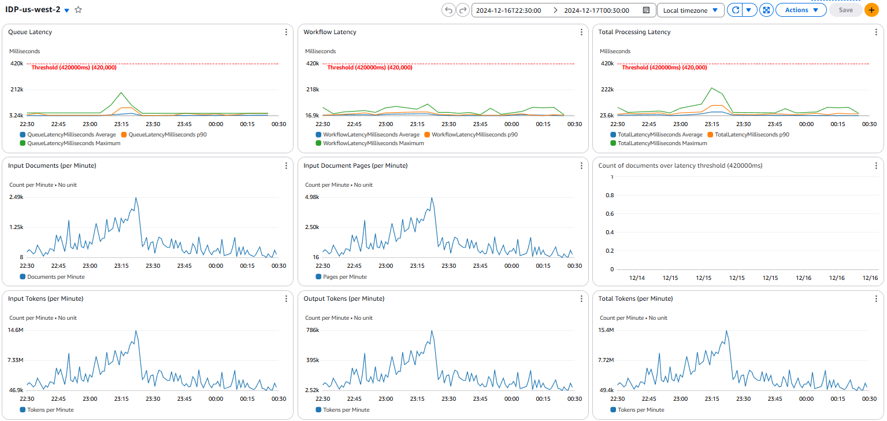
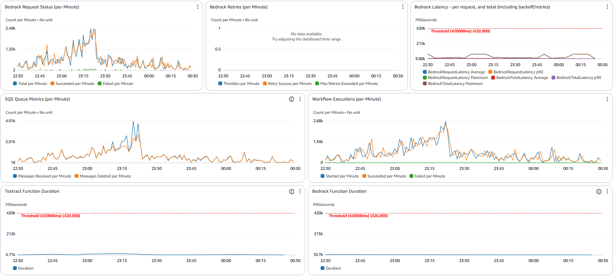
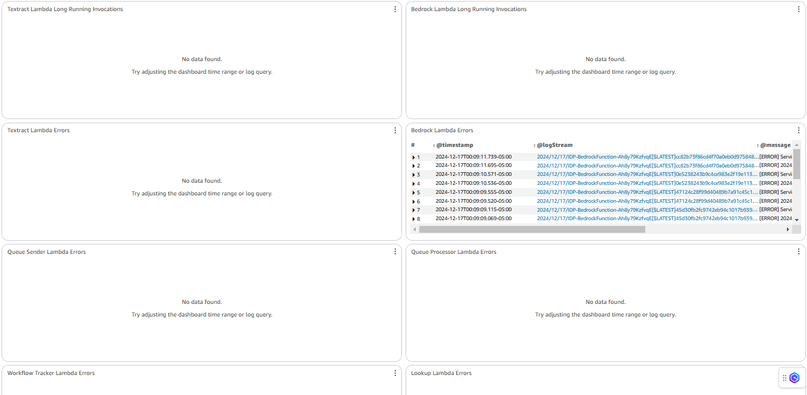

Copyright Amazon.com, Inc. or its affiliates. All Rights Reserved.
SPDX-License-Identifier: MIT-0

# Monitoring and Logging

The GenAIIDP solution provides comprehensive monitoring through Amazon CloudWatch to give you visibility into the document processing pipeline.

## CloudWatch Dashboard

The solution automatically creates an integrated dashboard that displays:

### Latency Metrics

- **End-to-End Processing Time**: Total time from document upload to completion
- **Step Function Execution Duration**: Time spent in workflow orchestration
- **Lambda Function Latency**: Processing time per function (OCR, Classification, Extraction)
- **Queue Wait Time**: Time documents spend in processing queues
- **Model Inference Time**: Bedrock model response latencies



### Throughput Metrics

- **Documents Processed per Hour**: Overall system throughput
- **Pages Processed per Minute**: OCR processing rate
- **Classification Requests per Second**: Page classification throughput
- **Extraction Completions per Hour**: Field extraction processing rate
- **Queue Message Rate**: SQS message processing velocity



### Error Tracking

- **Workflow Failures**: Step Function execution failures with error categorization
- **Lambda Timeouts**: Function timeout events and duration analysis
- **Model Throttling**: Bedrock throttling events and retry patterns
- **Dead Letter Queue Messages**: Failed messages requiring manual intervention
- **Validation Errors**: Data validation failures and format issues



### Document Queue Backlog and Dead-Letter Queue Depth

Two widgets cover the SQS layer between upload and execution, which is where a
document can be lost or stuck without any Step Functions metric noticing:

- **Document Queue Backlog** — messages waiting, messages in flight, and the
  **age of the oldest message** on the right axis, with a horizontal annotation
  at `QueueStalledAgeThresholdSeconds`.
- **Dead-Letter Queue Depth** — the document, queue-sender, and workflow-tracker
  DLQs on one graph. Every line has its own alarm, and any non-zero value means a
  document that needs a human.

**Reading the backlog widget:** depth on its own is not a problem. The queue
processor gates on the workflow-concurrency counter and *refuses* a message by
letting its 30-second visibility timeout lapse, so a bulk upload legitimately
parks thousands of messages. Rising depth with a **flat** age line is a queue
draining under load. A **climbing** age line while the SQS throughput widget
shows nothing being deleted is a stall — see
[`DocumentQueueStalledAlarm`](#documentqueuestalledalarm--why-it-is-not-a-queue-depth-alarm).

### Workflow Concurrency Counter

The stack limits in-flight workflows with a DynamoDB counter: the queue processor
increments it before `StartExecution`, and the workflow tracker decrements it on
the execution's terminal event. If a decrement is ever lost, the counter drifts
**upward** and nothing puts it back — so once it reaches
`MaxConcurrentWorkflows`, documents stop starting **permanently**.

That failure is quiet. Every other signal looks *idle* rather than broken: no
errors, no failed executions, latency graphs simply stop. The usual first symptom
is a person noticing that nothing has processed for hours.

Two metrics in the stack's own namespace (`<StackName>`) make it visible, both on
the **Workflow Concurrency Counter** widget:

- **`ConcurrencyCounterActive`** — the counter value, published on every document
  completion. Continuous, so there is a history to inspect after the fact.
- **`ConcurrencyCounterDrift`** — claimed slots minus executions actually
  running. Sampled only when an increment is *refused*, i.e. when drift is
  actually blocking work.

Two alarms publish to `AlertsTopic`:

- **`ConcurrencyCounterDriftAlarm`** — sustained drift (> 0 for 15 minutes). This
  fires on the *symptom*, once slots are already being held wrongly.
- **`WorkflowTrackerDLQAlarm`** — any message in the Workflow Tracker
  dead-letter queue. This fires on the *cause*: the tracker owns the decrement,
  so an event it could not process is a slot that was never released, and it
  alarms on the first message rather than waiting for drift to accumulate.

The queue processor also **self-heals**: on a refused increment it
reconciles the counter against `ListExecutions`, requiring the same discrepancy
in two samples at least five minutes apart, only ever lowering it, and writing
conditionally on the value it sampled.

**Reading the widget:** the counter tracking a busy queue is normal. The counter
sitting at or near `MaxConcurrentWorkflows` while the SQS widget shows messages
in flight and the Step Functions widget shows nothing starting is the leak.

### Stale Output Purge on Re-upload

OCR has a retry-safe recovery path: on a Step Functions retry the document is
reloaded with `pages={}`, so before re-OCRing it scans
`s3://<OutputBucket>/<key>/pages/` and reuses any page that already has all four
of its files (`rawText.json`, `result.json`, `textConfidence.json`, `image.*`).
That is what makes a throttled OCR retry cheap — and it is also why uploading a
**different** document under an **existing** filename used to produce the
previous document's extraction ([#719](https://github.com/aws-solutions-library-samples/accelerated-intelligent-document-processing-on-aws/issues/719)).
Two paths now purge before processing: the queue sender removes `<key>/pages/`
on every upload event, and the **Reprocess** action removes everything under
`<key>/` except `<key>/runs/` (matching its "start over" intent).

This failure is quiet in the same way the concurrency leak is: if the purge only
partly succeeds, the document processes, reports success, and silently carries
text from the old document — recovery needs just **one** surviving complete page
to skip OCR for it. Processing deliberately continues on a purge failure (a
possibly-stale extraction beats a dropped upload or a refused reprocess), so the
signal has to come from a metric rather than the document's own status.

One metric in the stack's own namespace (`<StackName>`):

- **`StaleOutputPurgeFailed`** — published (value `1`) whenever a purge raises.
  Both the ingest path and the reprocess path publish it, with no dimensions and
  into the **root** stack's namespace, so one metric and one alarm cover both.
  Published only on failure, so no data means every purge succeeded.

One alarm publishes to `AlertsTopic`:

- **`StaleOutputPurgeFailedAlarm`** — any occurrence within 5 minutes. Unlike
  concurrency drift there is no self-healing path: the stale pages sit in S3
  until someone removes them, and every later upload of that key inherits the
  same wrong results — so this alarms on the **first** failure rather than on a
  sustained trend.

Two dashboard widgets are paired on the main dashboard: **Stale Output Purge
Failures** (the count across both paths) and **Stale Output Purge Failures —
affected keys** (a Logs Insights table over the Queue Sender log group).

**Recovering:** identify the affected keys, then delete
`s3://<OutputBucket>/<key>/pages/` and re-upload or reprocess the document.
The log widget covers the ingest path; for the reprocess path, query the
`ReprocessDocumentResolverFunction` log group (in the API-resolvers nested
stack) instead. The two paths log different messages:

| Path | Log group | Message |
|---|---|---|
| Upload / re-upload | `QueueSender` | `Failed to purge previous output data for <key>` |
| Reprocess action | `ReprocessDocumentResolverFunction` | `Failed to delete previous output data for <key>` |

The most common cause is a KMS or bucket-policy change that denies
`s3:DeleteObject` to the purging role — check that before assuming a transient
S3 error.

**Note:** because the purge runs on every upload, a re-upload of a
byte-identical file no longer reuses the prior OCR cache; it re-OCRs from
scratch.

## Log Groups

The solution creates centralized logging across all components:

- `/aws/stepfunctions/IDPWorkflow`: Step Function execution logs
- `/aws/lambda/QueueProcessor`: Document queue processing logs
- `/aws/lambda/OCRFunction`: OCR processing logs and errors
- `/aws/lambda/ClassificationFunction`: Classification processing logs
- `/aws/lambda/ExtractionFunction`: Extraction processing logs
- `/aws/lambda/TrackingFunction`: Document tracking and status logs
- `/aws/appsync/GraphQLAPI`: Web UI API access logs

All logs include correlation IDs for tracing individual document processing journeys.

## Pattern-Specific Monitoring

Each pattern includes additional monitoring tailored to its specific workflow:

### Pattern 1: Bedrock Data Automation (BDA)
- BDA project execution metrics
- API usage and throttling
- Media processor performance

### Pattern 2: Textract + Bedrock
- Textract OCR performance
- Bedrock model usage
- Classification confidence distribution
- Extraction completeness metrics

### Pattern 3: Textract + UDOP + Bedrock
- SageMaker endpoint performance
- UDOP model latency and throughput
- GPU utilization metrics

## Alarms the Stack Creates

Subscribe an email address or a chat webhook to the alarm's SNS topic to receive
these — the alarms exist whether or not anything is subscribed, so a stack with
no subscription raises alarms that nobody sees.

> ⚠️ **On stacks deployed before release 0.6.7 with the circuit breaker disabled
> (the default), no alarm notification was ever delivered.** `AlertsTopic` is
> always encrypted with the stack's customer-managed key, but the key policy
> statement granting CloudWatch permission to use it was conditional on
> `CircuitBreakerEnabled=true`. With the default `false`, every alarm action
> failed with *"CloudWatch Alarms does not have authorization to access the SNS
> topic encryption key"* — visible only in each alarm's **Actions** history, since
> the alarm itself still transitioned to `ALARM` in the console. The grant is now
> unconditional. If you upgrade a stack that has been alarming silently, expect
> notifications to start arriving; to confirm, check
> `aws cloudwatch describe-alarm-history --alarm-name <name> --history-item-type Action`
> before and after.

All of them set `TreatMissingData: notBreaching`, so an idle stack reads `OK`
rather than `INSUFFICIENT_DATA`. That is deliberate: for these signals "no
documents processed" genuinely means "no failures", and leaving alarms parked in
`INSUFFICIENT_DATA` makes a **broken** alarm indistinguishable from a quiet one
(see the `WorkflowErrorsAlarm` note below).

| Alarm | Fires when | Topic | Tuned by |
|---|---|---|---|
| `WorkflowErrorsAlarm` | Failed Step Functions executions ≥ threshold in 5 min | `AlertsTopic` | `ErrorThreshold` (default `1`) |
| `SlowExecutionsAlarm` | Average execution time exceeds the threshold over 5 min | `AlertsTopic` | `ExecutionTimeThresholdMs` (default `300000`, i.e. 300 s) |
| `ConcurrencyCounterDriftAlarm` | Concurrency drift > 0 sustained for 15 min | `AlertsTopic` | — |
| `DocumentQueueDLQAlarm` | Any message in the document DLQ — a document that failed every retry | `AlertsTopic` | — |
| `QueueSenderDLQAlarm` | Any message in the queue-sender DLQ — an upload that was never enqueued | `AlertsTopic` | — |
| `DocumentQueueStalledAlarm` | Oldest queued document older than the threshold **and** nothing left the queue, for 30 min | `AlertsTopic` | `QueueStalledAgeThresholdSeconds` (default `1800`, i.e. 30 min) |
| `WorkflowTrackerDLQAlarm` | Any message in the Workflow Tracker DLQ | `AlertsTopic` | — |
| `StaleOutputPurgeFailedAlarm` | Any output-purge failure within 5 min | `AlertsTopic` | — |
| `DataMartRollupDLQAlarm` | Any message in the reporting-rollup DLQ | `AlertsTopic` | — |
| `BedrockServiceOutageAlarm` | Combined Bedrock error count exceeds the circuit-breaker threshold | `CircuitBreakerTopic` | `CircuitBreakerFailureThreshold` and the `CircuitBreakerTrigger*` toggles |

`AlertsTopic` carries the display name **Workflow Alerts**.
`BedrockServiceOutageAlarm` is created only when the circuit breaker is enabled
and reports to its own topic, since it drives automated back-off rather than
human attention.

### `WorkflowErrorsAlarm` — the primary failure signal

`ErrorThreshold` defaults to `1`, so this is an **alert on any failed
execution** rather than on a rate. That matches document processing, where each
failed execution is a document that did not get processed; a percentage
threshold would stay silent on a low-volume day when everything failed. Raise
`ErrorThreshold` if you routinely submit documents you expect to fail (malformed
uploads, for instance) and only want to hear about clusters.

Note that this counts *failed executions*. A document that fails in a way the
state machine catches and handles finishes as a **successful** execution, so it
does not appear here — use the **Processing Issues** column in the Web UI and the
Processing Report for those. `ExecutionsTimedOut` and `ExecutionsAborted` are
also separate metrics and are not covered by this alarm.

> ⚠️ **Before release 0.6.7 this alarm never fired.** It was defined against
> `ExecutionsFailedCount`, which is not a metric Step Functions publishes, so it
> received no datapoints and stayed in `INSUFFICIENT_DATA` through real failures
> ([#746](https://github.com/aws-solutions-library-samples/accelerated-intelligent-document-processing-on-aws/issues/746)).
> If you upgrade a stack that has been failing silently, expect notifications to
> start arriving immediately — that is the fix working, not a new problem.

### `SlowExecutionsAlarm` — check the threshold against your documents

This compares the **average** execution time over 5 minutes against
`ExecutionTimeThresholdMs`. The 300-second default suits small documents; large
packets, agentic extraction, and summarization all routinely exceed it, so a
deployment that processes those should raise the parameter or the alarm will
report normal operation as a problem. Because it is an average, one slow document
in a busy 5-minute window will not trip it — this is a "the whole pipeline is
slow" signal, not a per-document one.

### The queue alarms — the gap both of the above leave

Both alarms above read the **state machine**, so neither can see a document that
never got an execution ([#761](https://github.com/aws-solutions-library-samples/accelerated-intelligent-document-processing-on-aws/issues/761)):
a dead-lettered document emits no `ExecutionsFailed`, and a document still sitting
in the queue emits no `ExecutionTime`. Three alarms cover the queue layer.

#### `DocumentQueueDLQAlarm` and `QueueSenderDLQAlarm`

Both fire on the **first** message, with no threshold to tune, and both also
notify on recovery (`OKActions`) — DLQ depth does not decay on its own, so the
`OK` notification is how you know someone actually drained the queue.
`WorkflowTrackerDLQAlarm` now does the same, so all three DLQ lines on the
**Dead-Letter Queue Depth** widget behave alike.

| Alarm | What a message means | Recovery |
|---|---|---|
| `DocumentQueueDLQAlarm` | The document exhausted `DocumentQueue`'s redrive policy — `maxReceiveCount` 1000 against a 30 s visibility timeout, roughly **8 hours** of retries — and never processed. | Read the messages for the object keys, find the cause in the QueueProcessor and state-machine logs, then redrive or re-upload. Redrive needs `kms:Decrypt` on the stack's CMK. |
| `QueueSenderDLQAlarm` | The upload event never reached the queue, so the document never entered the pipeline. | Read the messages for the S3 keys, check the QueueSender logs, then **re-upload**. See the note below on which state the document is left in — and note that SQS redrive does **not** apply to this queue. |

> **What a `QueueSenderDLQ` message means for the document, precisely.** The
> queue sender writes the tracking record *before* it enqueues
> (`src/lambda/queue_sender/index.py`), so where the invocation died decides what
> you see: a failed **enqueue** leaves a row wedged at `QUEUED` in the Web UI
> forever, while a failed **`create_document`** leaves no record at all. Look for
> the stuck `QUEUED` document first — that is the likelier case in a queue named
> for the sender. Recovery is re-upload either way: `QueueSenderDLQ` is a Lambda
> **async-invoke** DLQ, not the dead-letter queue of another SQS queue, so
> `StartMessageMoveTask` (the console's *Redrive* button) does not apply to it and
> is not offered. `DocumentQueueDLQ` *is* a true SQS DLQ, so redrive does work
> there.

#### `DocumentQueueStalledAlarm` — why it is not a queue-depth alarm

"Not draining" cannot be alarmed on queue **depth**, because waiting is the
design: the queue processor refuses a message by letting its visibility timeout
lapse while workflow concurrency is saturated.

It cannot be alarmed on message **age** alone either, and that is less obvious.
Because a refused message is never deleted and re-sent,
`ApproximateAgeOfOldestMessage` measures time since the *original* send, so it
climbs monotonically for as long as concurrency stays saturated — a healthy stack
draining a large batch will pass any fixed age threshold.

So the alarm requires **both** conditions in one metric-math expression: the
oldest message is older than `QueueStalledAgeThresholdSeconds` **and** not a
single message was deleted in the period. Deep but draining stays `OK` at any
depth; a wedged consumer fires.

**Why the window is 30 minutes** (six 5-minute periods, where the other alarms
here use one to three). A message leaves `DocumentQueue` only when a workflow
slot frees up, so with concurrency saturated by long-running documents a
*healthy* stack can legitimately delete nothing for as long as its slowest
document takes. A shorter window would page on ordinary large-packet
processing — and an alarm that cries wolf gets muted, which costs more than the
detection latency. Thirty minutes of **zero** dequeues is where "slow" and
"stuck" stop being distinguishable from outside, and it deserves attention
either way: at that point it is either a wedge or a capacity shortfall.

**Expect roughly an hour of detection latency at the defaults**, not 30 minutes:
the age condition has to be met *first* (30 minutes at the default threshold) and
the 30-minute no-progress window then runs on top of it. Lower
`QueueStalledAgeThresholdSeconds` to shorten that, at the cost of firing during
saturation.

**A circuit-breaker pause trips this alarm too, by design.** A processor in the
`OPEN` state pushes a message's visibility out to
`CircuitBreakerRecoveryTimeoutSeconds` *without deleting it*, so age climbs and
deletions stay at zero — both conditions hold. That is not suppressed, because
muting the queue signal for the duration of a Bedrock outage would mute it
exactly when documents pile up. If `BedrockServiceOutageAlarm` is active on the
same topic, this alarm is reporting the same incident and clears on its own when
the breaker closes. Only relevant when the circuit breaker is enabled, which is
not the default.

**One reporting caveat.** SQS stops publishing queue metrics for a queue that has
been inactive for about six hours. In the specific case where the consumer is
fully detached *and* no new documents arrive, `FILL(m1, 0)` then yields `0`, the
condition goes false, and the alarm returns to `OK` while the queue is still
stuck. It will have fired first, so the notification is not lost — but do not
read a later `OK` as "resolved" without checking the queue.

**Tuning.** Raise `QueueStalledAgeThresholdSeconds` (default `1800`) if bulk
uploads against a low `MaxConcurrentWorkflows` trip it and you consider that
normal. Because the alarm already requires zero throughput, the threshold is
"how long is too long to wait with no progress whatsoever", not a backlog limit.

**When it fires**, check in this order: the **Workflow Concurrency Counter**
widget (a counter pinned at `MaxConcurrentWorkflows` with nothing running is a
leaked slot — `ConcurrencyCounterDriftAlarm` covers that case), the
circuit-breaker state, whether the QueueProcessor event-source mapping is still
enabled, then QueueProcessor invocations, errors, and throttles. If executions
**are** running and each simply takes longer than 30 minutes, this is a capacity
signal rather than a fault: raise `MaxConcurrentWorkflows`, or raise the
threshold to accept it.

### `BDACallbackTimeoutSeconds` — why a hung BDA job needs its own bound

This one is a parameter rather than an alarm, but it belongs here because without
it **neither alarm above can see the failure it prevents.**

In BDA mode (`use_bda: true`) the `BDA_InvokeDataAutomation` step uses the Step
Functions `.waitForTaskToken` integration: it blocks until something outside the
state machine returns the token. The return path is
BDA job → EventBridge (`BDAEventRule`) → `BDACompletionFunction` → task token
read from S3 → `SendTaskSuccess`. Any hop can break — a stuck BDA job, a lost
token, a dropped EventBridge delivery, the completion handler erroring before it
responds.

Before release 0.6.7 that step had no `TimeoutSeconds`, so a broken callback left
the execution waiting **indefinitely**, and that is the worst possible shape for
monitoring:

- it never fails, so it emits no `ExecutionsFailed` → `WorkflowErrorsAlarm` is blind;
- it never completes, so it emits no `ExecutionTime` → `SlowExecutionsAlarm` is blind;
- it holds a **workflow-concurrency slot** and its tracking row the whole time.

A stack could therefore lose capacity with every alarm reading `OK`. The step is
now bounded by `BDACallbackTimeoutSeconds` (default **7200**, i.e. 2 hours), and
because the step catches `States.ALL` and routes to the fail state, tripping the
bound produces a genuinely **FAILED** execution — which emits `ExecutionsFailed`,
fires `WorkflowErrorsAlarm`, and lets the workflow tracker release the
concurrency slot and mark the document `FAILED`. A stuck document becomes an
ordinary, visible failure.

**Tuning.** The asymmetry favours a generous value: too high only delays
detection of a job that is already lost, whereas too low fails healthy work and
wastes the BDA spend already incurred. Raise it if you process very large packets
and see `States.Timeout` failures on documents that were progressing normally. A
timeout is deliberately **not** retried — re-invoking would start a second BDA
job, paying twice and risking double-processing, for a callback that may still be
in flight.

> **Pipeline mode is unaffected.** Those steps are direct Lambda invocations with
> their own function timeouts plus `Retry`/`Catch`, so they cannot hang: a failure
> propagates to `ExecutionsFailed` on its own.

## Setting Up Alerts

Beyond the built-in alarms you can add your own for metrics specific to your
deployment:

1. **Error Rate Thresholds**: Alert when error rates exceed acceptable levels
2. **Processing Time Anomalies**: Detect unusual latency spikes
3. **Concurrency Limits**: Notify when approaching service limits
4. **Cost Controls**: Alert on unusual model usage patterns

Queue backlog and DLQ depth are already covered by the built-in alarms above, and
a plain "depth > N" alarm on `DocumentQueue` is specifically **not** worth adding
— see [`DocumentQueueStalledAlarm`](#documentqueuestalledalarm--why-it-is-not-a-queue-depth-alarm)
for why depth alone is not a fault signal in this architecture.

Example alarm configuration:

```yaml
ErrorRateAlarm:
  Type: AWS::CloudWatch::Alarm
  Properties:
    AlarmDescription: Alert when error rate exceeds 5%
    MetricName: DocumentProcessingErrors
    Namespace: AWS/Lambda
    Statistic: Sum
    Period: 300
    EvaluationPeriods: 1
    Threshold: 5
    ComparisonOperator: GreaterThanThreshold
    TreatMissingData: notBreaching
    AlarmActions:
      - !Ref AlertSNSTopic
```

## Log Insights Queries

The solution includes predefined CloudWatch Log Insights queries for common analysis tasks:

### Error Analysis

```
filter @message like /ERROR/ or @message like /Exception/
| parse @message "Error: *" as errorMessage
| stats count(*) as errorCount by errorMessage
| sort by errorCount desc
| limit 10
```

### Processing Time Analysis

```
filter @message like /Processing complete/
| parse @message "Processing complete in * ms" as processingTime
| stats avg(processingTime) as avgTime, min(processingTime) as minTime, max(processingTime) as maxTime by bin(30m)
| sort by avgTime desc
```

### Document Volume Tracking

```
filter @message like /Document received/
| stats count(*) as documentCount by bin(1h)
| sort by bin(1h) asc
```

## Metric Dimensions

Key metrics are available with these dimensions:

- **DocumentType**: Break down metrics by document class
- **ProcessingPattern**: Compare metrics across different patterns
- **PageCount**: Analyze performance based on document complexity
- **Region**: Track regional performance differences

## Performance Benchmarks

The dashboard includes performance benchmark comparisons:

- **Current vs. Historical Performance**: Compare current metrics against previous periods
- **Pattern Comparison**: Side-by-side comparison of different processing patterns
- **Model Performance**: Comparison of different Bedrock models for similar tasks

## Operational Monitoring

The solution provides operational metrics for infrastructure health:

- **Lambda Concurrency**: Track function concurrency usage
- **Throttling Events**: Monitor service limits and throttling
- **DynamoDB Capacity**: Track consumed read/write capacity units
- **S3 Request Rates**: Monitor bucket operation rates and latency
- **Step Functions Execution Metrics**: Track state transitions and execution counts

## Cost Monitoring

Monitor resource usage and costs:

- **Bedrock Model Tokens**: Track token usage by model and operation
- **Lambda Execution Time**: Monitor function duration and memory usage
- **S3 Storage**: Track storage growth over time
- **Data Transfer**: Monitor network costs between services

## Custom Dashboard Creation

You can create custom dashboards focused on specific aspects:

1. Open the CloudWatch console
2. Go to Dashboards and select "Create dashboard"
3. Add widgets using metrics from the "GenAIIDP" namespace
4. Organize widgets logically by processing stage or metric type

## Exporting Metrics

To export metrics for external analysis:

1. Use CloudWatch Metric Streams to send metrics to:
   - Amazon Kinesis Data Firehose
   - Third-party monitoring tools
   - Custom analytics solutions

2. Configure the stream with:
   - Metrics namespace filters
   - Output format (JSON or OpenTelemetry)
   - Destination configuration
