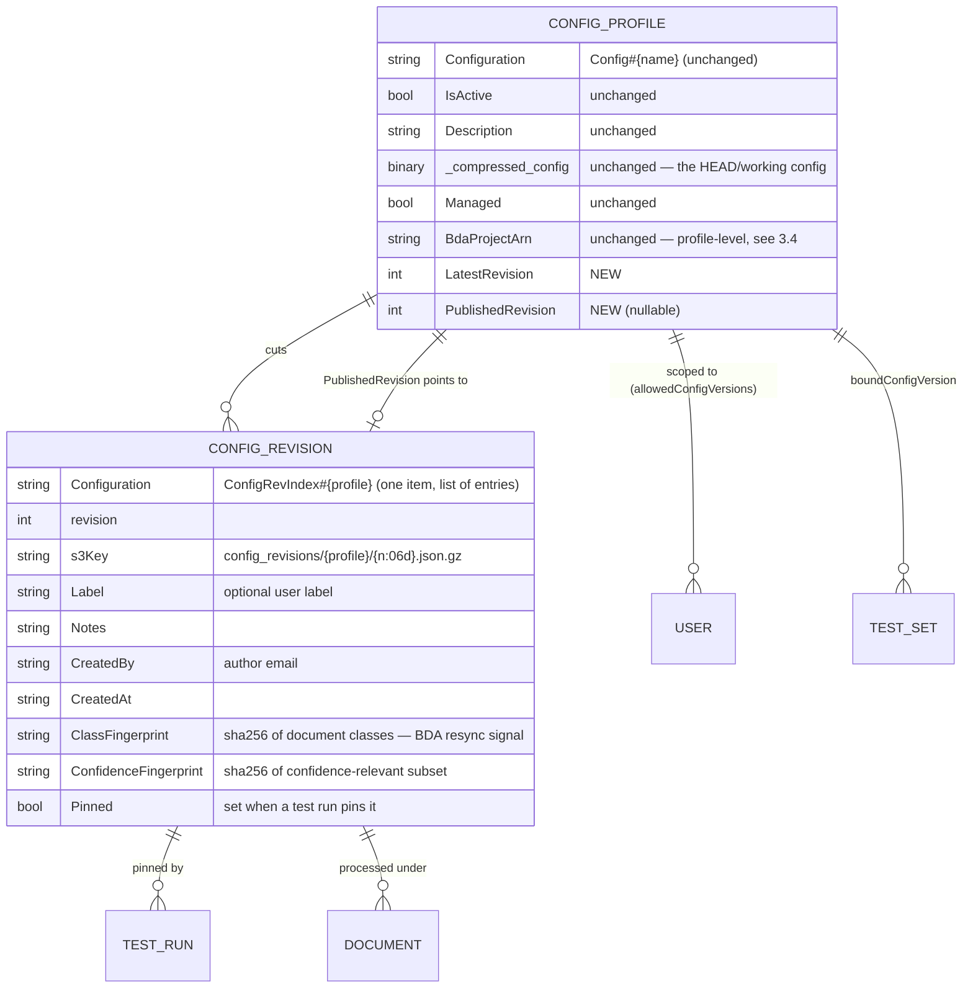

# Proposal: Configuration Profiles and Revisions

**Status:** Phases 0, 1 and 2 implemented (see §10 for where the implementation
departs from this document). **Phase 3 is closed as unnecessary** — see the reasoning
and the two signals that would reopen it.

Splits today's single "configuration version" concept into two: a **Configuration
Profile** (the named, access-controlled entity) and its **Revisions** (immutable
numbered snapshots of that profile's configuration). Adds config history with
diff/restore/rollback, lets a scoped Author iterate without destroying the previous
config or needing an Admin, and lets Test Studio pin and compare revisions.

**Decisions already taken** (drove the rest of this document):

| Decision | Choice |
|---|---|
| Entity name | **Configuration Profile** (bare "Profile" inside config UI; API identifiers always qualified `configProfile*`) |
| Revision body storage | S3 bodies in `ConfigurationBucket` + a small DynamoDB metadata index (one item per profile — see §3.1) |
| Retention | Cap per profile (last N) + keep labeled and test-run-pinned revisions |

---

## 1. The problem

`Config#<name>` in the `ConfigurationTable` is currently doing three orthogonal jobs
at once:

| Axis | What it actually is | Who should control it |
|---|---|---|
| **Identity / tenancy** | The RBAC object (`allowedConfigVersions`), the document-visibility partition, the target of a test set's `boundConfigVersion` | Admin |
| **Lineage** | "the same thing, later" — a prompt iteration, a model swap, an upgrade-driven change | Author, within scope |
| **Selection** | What new documents process under (`IsActive`), what a test run uses | Author, within scope |

Because lineage has no home, users express it by **minting new identities**
(`usecaseA_v1`, `usecaseA_v2`, …). Every such name is a new RBAC object, a new
document-visibility partition, a new confidence-curve bucket, and a new row an Admin
must add to every scoped user's `allowedConfigVersions`.

Concrete consequences in the current code:

- **A scoped Author cannot iterate without destroying history.** `saveAsVersion` is
  Admin-only (`nested/api-resolvers/src/lambda/configuration_resolver/index.py:272`),
  while a plain `updateConfiguration` on an in-scope version *is* permitted
  (`:253`). So the only move available to an Author is an in-place overwrite: no
  undo, no diff-against-yesterday, no rollback.
- **Lineage-as-identity is already happening automatically.**
  `feature-platform/main-stack-extensions/lambdas/apply_feature_config_preset/index.py`
  creates versions like `sample-health-insurance-review-v0.1.6`. Every feature
  upgrade adds a name that Admins must re-scope users onto, and old names linger.
- **Stack upgrades are destructive or ignored.** Managed versions are overwritten in
  place; custom versions are never updated, and the only remedy is "Reset to
  Default", which clobbers all customization. There is no way to see *what* an
  upgrade changed.
- **Terminology is unrecoverable.** "Version" already means *immutable numbered
  snapshot* in two other places in this product — document versions
  (`docs/document-versions.md`) and test set versions
  (`docs/proposals/ground-truth-hitl/data-model.md`). Config is the odd one out,
  where "version" means the named entity itself. Hence "versions of a config
  version".

## 2. Terminology

| Term | Meaning |
|---|---|
| **Configuration Profile** (UI: "Profile") | The named entity that exists today (`default`, `Production`, `lending`). The RBAC object, the document partition, the activation target. |
| **Revision** (`r7`) | An immutable numbered snapshot of one profile's configuration. Cut on every save. |
| **Configuration** | Unchanged — the *content*: OCR/classification/extraction/assessment settings, classes, prompts. What `get_configuration()` returns and the editor form edits. |
| ~~Configuration version~~ | Retired from UI and docs. Retained as a wire/DB name (`ConfigVersion`, `versionName`, `allowedConfigVersions`) for compatibility, and as an accepted CLI/SDK alias (`--config-version`, `config_version=`) alongside the new `--config-profile` / `config_profile=`. |

Naming rules:

- **Never a bare `profile` in API or code identifiers** — `profile` already means
  *user* profile (`getMyProfile`, `persona`). Use `configProfile`,
  `listConfigProfiles`, `getConfigProfileRevisions`.
- "Configuration" keeps its existing meaning, so no already-written sentence, log
  line, or ticket becomes wrong.
- Revisions are called revisions, never versions, so any text is unambiguous about
  which era it is from.

## 3. Data model

**Guiding principle: the profile *head* remains the only thing the runtime resolves
by default.** Everything else is additive, so the ~189 files that reference
`config_version` / `ConfigVersion` keep working untouched.

### 3.1 Keys

- Profile head: `Config#<profile>` — **unchanged**, still holds the working config as
  a gzip Binary attribute.
- Revision metadata: ONE index item per profile, `ConfigRevIndex#<profile>`, holding
  a small entry per retained revision. **Refined during implementation** from
  per-revision pointer items: with a single index item, listing a profile's history
  is one `get_item` rather than a `Scan` of the table, and appends can use DynamoDB's
  native `list_append`, which cannot lose a concurrent append. The `ConfigRevIndex#`
  prefix deliberately does **not** match the existing
  `begins_with(Configuration, "Config#")` scan in
  `ConfigurationManager.list_config_versions()`, so revisions can never leak into
  the profile list (which feeds the scope-filtered dropdowns). It also cannot
  collide with the legacy `Config#custom` / `Config#default#…` key shapes handled in
  `src/lambda/update_configuration/index.py`.
- Revision body: `s3://<ConfigurationBucket>/config_revisions/<profile>/<000007>.json.gz`.

### 3.2 Why bodies in S3

`ConfigurationTable` is HASH-only (`Configuration`), so listing revisions of a
profile requires a `Scan`. DynamoDB bills a scan on **full item size regardless of
`ProjectionExpression`**, and a 3,000-class config compresses to a large blob. Keeping
revision *bodies* out of the table keeps that scan cheap forever. S3 also gives
lifecycle-based cleanup, and because the revision number is part of the key, each
revision object is write-once — immutability comes from the key, not from S3 object
versioning (which the bucket has anyway, as belt-and-braces).

### 3.3 Two required cost fixes (in scope, not optional)

1. **Get `resolve_active_version()` off the scan.** It is called per document at queue
   time (`src/lambda/queue_sender/index.py:32` →
   `ConfigurationManager.resolve_active_version`, built on `list_config_versions()`).
   Replace with a single `get_item` on a pointer record `Config#__active`, maintained
   by `activate_version()`. This is a win independent of this proposal.
2. **Cap revisions per profile** — see §7.

### 3.4 Profile-level vs revision-level state

`IsActive`, `Description`, `Managed`, `BdaProjectArn`, `BdaSyncStatus` stay on the
**profile head** — a BDA project is one external resource per profile. But a revision
that changes document classes invalidates that sync, so each revision stores a
`ClassFingerprint`; the UI surfaces "BDA resync required" when the published
revision's fingerprint differs from the one that was synced.

## 4. Resolution and selection

Add `Document.config_revision: Optional[int]` alongside the existing
`config_version` (`lib/idp_common_pkg/idp_common/models.py:371`), and a `revision`
parameter to `get_config()` / `ConfigurationManager.get_configuration()`.

Resolution order inside `ConfigurationManager`:

1. explicit `revision` → read that revision's S3 body;
2. else the profile's `PublishedRevision` → that revision's body;
3. else the profile head item (today's behavior).

**Do not encode this as a composite string** (`lending@7`) flowing end-to-end. That
string is compared for equality against `allowedConfigVersions` in
`configuration_resolver/index.py` and `list_documents_gsi_resolver/index.py`; an
unparsed composite would either over-match (a scope bypass) or silently deny. Keep
`ConfigVersion` = profile name — RBAC-safe and unchanged — and carry the revision as
its own field through S3 object metadata (`config-revision`), the SQS body, the Step
Functions input, and the tracking table.

Selection semantics:

- Global **active profile** — unchanged (`IsActive`, `setActiveVersion`).
- Per-profile **published revision** — what the active profile actually runs. New
  `publishConfigProfileRevision` operation ("promote"); rollback is publishing an
  earlier revision.
- A save always cuts a new revision and advances `LatestRevision`. Whether it also
  advances `PublishedRevision` is a UI choice: default **yes** for parity with
  today's behavior (save = takes effect), with an explicit "save as draft revision"
  for profiles where an Author wants to test before promoting.

## 5. RBAC

The core payoff: **once history exists, most of the RBAC problem dissolves without a
permission-model change**, because the only reason an Author needs Admin-only
`saveAsVersion` today is to avoid destroying the previous config.

The invariant worth writing down: **revisions are content; profiles are
access-control objects. Authors move content, only Admins mint objects.**

| Operation | Today | Proposed |
|---|---|---|
| Save changes to an in-scope profile (cuts a revision) | Admin, Author (scoped) | unchanged — now non-destructive |
| List / view / diff revisions of an in-scope profile | n/a | Admin, Author, Viewer (scoped) |
| Restore an earlier revision (as a new revision) | n/a | Admin, Author (scoped) |
| Publish / promote a revision within an in-scope profile | n/a | Admin, Author (scoped) |
| Label a revision | n/a | Admin, Author (scoped) |
| Create a **new profile** (`saveAsVersion`) | Admin | **stays Admin** — minting an RBAC object is a privilege boundary |
| Save as Default | Admin | unchanged |
| Set active profile | Admin, Author (scoped) | unchanged |
| Delete a revision | n/a | **Admin** (mirrors `deleteDocumentVersion`) |
| Delete a profile | Admin | unchanged |

Every new operation resolves its profile first and runs the **same scope check** used
by `updateConfiguration` — scope is enforced at the profile, never at the revision, so
there is exactly one place to get right.

### 5.1 Interim stopgap (optional, ship-before-this)

Support prefix patterns in `allowedConfigVersions` (`lending-*`) in the three scope
check sites. ~20 lines, makes today's `usecaseA_v1/v2/v3` convention survivable, and
is safe here specifically *because* Authors cannot create profiles. Glob ACLs age
badly — treat as a stopgap, not a destination.

### 5.2 Pre-existing scope holes to fix while in this code

Not caused by this proposal, but this work touches the same lines:

- `list_documents_gsi_resolver/index.py:306` **fails open** for documents with no
  `ConfigVersion` (`pass = not doc_version or doc_version in allowed_versions`). A
  scoped user sees unstamped documents. Should fail closed.
- `getDocument`, Knowledge Base queries, and Athena analytics are unscoped — already
  listed under Known Limitations in `docs/rbac.md`. Out of scope here; do not let
  this work imply they are fixed.

## 6. Test Studio

- **Pin `(profile, revision)` at run start**, alongside the existing test-set
  `activeReference` pin (`docs/test-studio.md:608`). This completes the attribution
  story the test-set design already aspires to: a metric delta becomes attributable
  to *config revision* vs *ground-truth version* vs noise. Today, comparing
  `usecaseA_v1` with `usecaseA_v2` cannot distinguish "same intent, tuned prompt"
  from "entirely different use case".
- **Run picker**: profile selector + revision selector defaulting to "published
  (r7)". Managed-preset auto-select (test set → matching managed profile) keeps
  working and now selects a revision too.
- **Comparison**: `compareTestRuns` already compares across profile names; add
  same-profile cross-revision comparison. The diff engine is the existing
  field-by-field config compare — one more axis, not new machinery.
- **Confidence curves need an explicit decision.** `curve_store.py` keys curves
  `curve#<config_version>` under `PK=testset#<id>` because "confidence means
  different things across models and prompts" (`docs/test-studio.md:721`). Keying per
  *revision* would cold-start the curve on every prompt tweak and destroy its value;
  keying per *profile* would silently mix incomparable semantics across a model
  swap. **Proposal:** key by `curve#<profile>@<ConfidenceFingerprint>`, where the
  fingerprint hashes only the confidence-relevant subset of the config (extraction
  and assessment model IDs, assessment config, assessment prompts). Revisions that
  do not touch those keep accumulating observations; a model swap correctly branches
  the curve. Existing `curve#<profile>` items remain readable as the pre-fingerprint
  bucket.
- Test runs that pin a revision mark it `Pinned=true` so retention never deletes a
  revision a retained comparison depends on (§7).

## 7. Retention

Pruning runs on write, after cutting revision N for a profile:

- Keep the last **N revisions** (default 20, stack parameter).
- Always keep: `PublishedRevision`, any revision with a user `Label`, any revision
  with `Pinned=true`.
- Delete the rest oldest-first — S3 object plus pointer item.

A count-based cap cannot be expressed as an S3 lifecycle rule, hence app-side
pruning. A belt-and-braces lifecycle rule on `config_revisions/` at
`DataRetentionInDays` is still worth adding for orphans, but the pinned/labeled
carve-out is the reason retention is not simply tied to that clock: a long-lived
pinned test run must outlive the ordinary revision window.

## 8. Managed profiles and stack upgrades

This is where the model pays for itself beyond authoring:

- A stack upgrade **cuts `default` r(n+1)** instead of overwriting, so
  `default@r(n-1) → default@rn` is a diff: you can see exactly what the upgrade
  changed to prompts, models, and defaults.
- Rollback becomes publishing the previous revision instead of restoring from an
  exported file.
- "Reset to Default" stops being a blunt clobber — it can offer "rebase onto default
  rN", showing the three-way difference first.
- Feature presets (`apply_feature_config_preset`) cut a **revision of one managed
  profile** instead of minting `…-v0.1.6`, `…-v0.1.7`, … names. Admins stop
  re-scoping users after every feature upgrade.

## 9. Migration

No backfill and no format change. Every existing `Config#<name>` **is** a profile;
on its first save it gains `LatestRevision=1` and its prior content is written as
revision 1 before the new content becomes revision 2. Profiles never saved after the
upgrade simply have no revision history, exactly like documents processed before
document versioning (`docs/document-versions.md` Caveats). Existing document
`ConfigVersion` stamps stay valid because they were already profile names.

## 10. What shipped, and where it departs from this proposal

Phases 0, 1 and 2 are implemented. Three deliberate departures in Phases 0–1:

1. **Revision metadata is one index item per profile** (`ConfigRevIndex#<profile>`),
   not one pointer item per revision — see §3.1. Listing becomes a single `get_item`
   and appends become atomic via `list_append`.
2. **No `compareConfigProfileRevisions` API.** The UI fetches both revisions and
   reuses the existing client-side `ConfigurationComparison` diff, so the server
   gained no comparison endpoint. Fewer moving parts, identical output.
3. **The feature-preset change is deferred** ([#697](https://github.com/aws-solutions-library-samples/accelerated-intelligent-document-processing-on-aws/issues/697)). `apply_feature_config_preset` still
   mints `<feature>-v<semver>` profile names. It writes raw sparse rows directly with
   `put_item` (bypassing `ConfigurationManager`), has no `idp_common` layer and no
   configuration-bucket access, and its version names are load-bearing for feature
   hook registration (`register_feature_hooks`) — so converting it needs its own
   migration story rather than riding along here. Tracked as follow-up work.

Also landed alongside, as authorized side fixes:

- The document-list and document-chat scope filters now **fail closed** on a
  document with no `ConfigVersion` (§5.2).
- `allowedConfigVersions` supports **glob patterns** (§5.1), via a single shared
  matcher (`idp_common/config_scope.py`) vendored into the two layer-free resolvers
  with a drift test.
- `resolve_active_version()` reads a pointer item instead of scanning, in
  `ConfigurationManager`, `queue_sender`, and the pipeline-hooks dispatcher (§3.3).

## 11. File-by-file change list

### Phase 0 — terminology only (no behavior change) (implemented)

| File | Change |
|---|---|
| `docs/configuration-versions.md` | Rename to `docs/configuration-profiles.md`; rewrite around Profile/Revision; keep a "was called configuration versions" compatibility note. Leave a stub or redirect for the old path. |
| `docs/rbac.md` | Config-Version Scoping → "Configuration Profile Scoping"; keep the `allowedConfigVersions` field name with a note. |
| `docs/test-studio.md`, `docs/configuration.md`, `docs/idp-cli.md`, `docs/document-versions.md` (Related link), `docs/web-ui.md` | Terminology pass. |
| `src/ui/src/components/configuration-layout/ConfigurationVersionsTable.tsx` | Labels: "Configuration Versions" → "Configuration Profiles"; "Create New Configuration Version" → "New Configuration Profile"; "Save as Version" → "Save as New Profile". |
| `src/ui/src/components/genaiidp-layout/navigation.tsx` | Nav label. |
| `CHANGELOG.md` | Changed entry noting the rename and that API/DB names are unchanged. |

### Phase 1 — revisions + history UI (self-contained; runtime still uses head) (implemented)

| File | Change |
|---|---|
| `lib/idp_common_pkg/idp_common/config/configuration_manager.py` | New: `cut_revision()`, `list_revisions(profile)`, `get_revision(profile, n)`, `restore_revision()`, `label_revision()`, `prune_revisions()`; S3 body read/write; `LatestRevision`/`PublishedRevision` on the head; call `cut_revision()` from `save_configuration()` for `CONFIG_TYPE_CONFIG`. |
| `…/config/models.py` | `ConfigRevisionRecord`; `latest_revision` / `published_revision` on `ConfigurationRecord`. |
| `…/config/configuration_manager.py` (`list_config_versions`, `resolve_active_version`, `activate_version`) | Exclude `ConfigRev#` keys defensively; add the `Config#__active` pointer item and read it with `get_item`. |
| `nested/api-resolvers/src/lambda/configuration_resolver/index.py` | New operations `listConfigProfileRevisions`, `getConfigProfileRevision`, `compareConfigProfileRevisions`, `restoreConfigProfileRevision`, `labelConfigProfileRevision`, `deleteConfigProfileRevision` (Admin), each behind the existing profile scope check and `_enforce_operation_group`. |
| `nested/api-resolvers/src/api/schema.graphql` | Corresponding queries/mutations + types, with `@aws_cognito_user_pools(cognito_groups:)` per §5. |
| `nested/api-resolvers/src/lambda/http_api_dispatcher/` | Route the new operations. |
| `nested/api-resolvers/template.yaml`, `template.yaml` | `ConfigurationBucket` read/write on `config_revisions/*` for the configuration resolver; revision-cap parameter. |
| `src/ui/src/hooks/use-configuration.ts`, new `use-config-profile-revisions.ts` | Fetch/label/restore revisions. |
| `src/ui/src/components/configuration-layout/` (new `ConfigRevisionHistoryPanel.tsx`) | History panel modeled on `document-panel/DocumentVersionsPanel.tsx`: newest-first, published badge, view / compare-two / restore / label / delete. Reuse the existing config comparison modal for the diff. |
| `src/lambda/update_configuration/index.py` | Cut a revision for `default` and each managed profile on stack deploy/upgrade instead of a silent overwrite. |
| `feature-platform/main-stack-extensions/lambdas/apply_feature_config_preset/index.py` | Cut a revision of one managed profile instead of minting `…-v<semver>` names. |
| `lib/idp_common_pkg/tests/unit/config/` | Cut/list/restore/prune, `ConfigRev#` never appearing in `list_config_versions()`, scope enforcement on every new operation, prune never deleting published/labeled/pinned. |

### Phase 2 — revision selection and pinning (implemented)

| File | Change |
|---|---|
| `lib/idp_common_pkg/idp_common/models.py` | `Document.config_revision` + serialization at `:440`, `:549`, `:902`, and S3 metadata read at `:663` (`config-revision`). |
| `lib/idp_common_pkg/idp_common/config/__init__.py` | `revision` parameter on `get_config()` (both overloads) and `ConfigurationReader`. |
| `patterns/unified/src/*/index.py` (ocr, classification, extraction + `sfn_runtime_handler`, assessment, summarization, evaluation, processresults, bda_processresults, rule-validation ×3, pipeline_hooks) | Pass `revision=document.config_revision` — 16 call sites. |
| `patterns/unified/template.yaml` | `s3:GetObject` on `config_revisions/*` for those functions (4 already have `ConfigurationBucket` read). |
| `src/lambda/queue_sender/index.py`, `src/lambda/queue_processor/index.py` | Stamp `config_revision` alongside `config_version` (published revision when unspecified). |
| `src/lambda/workflow_tracker/index.py`, `save_reporting_data`, `batch_pre_processor` | Persist/propagate `ConfigRevision`. |
| `nested/api-resolvers/src/lambda/upload_resolver`, `reprocess_document_resolver`, `create_document_resolver` | Accept and forward an optional revision. |
| `nested/api-resolvers/src/lambda/test_runner/index.py` | `_capture_config` by `(profile, revision)`; record `ConfigRevision` on the run; mark the revision `Pinned`. |
| `nested/api-resolvers/src/lambda/test_set_resolver/index.py` | Thread revision through draft labeling, review-effort, and `boundConfigVersion` handling. |
| `nested/api-resolvers/src/lambda/test_results_resolver/index.py` | Return `configRevision`; include in compare. |
| `lib/idp_common_pkg/idp_common/evaluation/curve_store.py`, `confidence_curve.py` | `curve_sk` → `curve#<profile>@<ConfidenceFingerprint>`; fall back to the legacy key on read. |
| `src/ui/src/components/upload-document/UploadDocumentPanel.tsx`, `common/ReprocessDocumentModal.tsx`, `test-studio/TestRunner.tsx`, `TestExecutions.tsx`, `GenerateDraftLabelsModal.tsx`, `TestResultsList.tsx`, `TestComparison.tsx`, `discovery/MultiDocDiscoveryPanel.tsx`, `capacity-planning/CapacityPlanningLayout.tsx` | Profile + revision pickers (default "published"); show revision in results and comparisons. |
| `src/ui/src/components/document-list/documents-table-config.tsx`, `document-panel/DocumentPanel.tsx`, `document-export.ts`, `map-document-attributes.ts` | Show/export `ConfigRevision`. |
| `lib/idp_sdk/idp_sdk/operations/config.py`, `idp_cli` | `--config-revision` on `run-inference`, `config-download`, `config-upload`; `config-revisions` list command. |
| `docs/configuration-profiles.md`, `docs/test-studio.md`, `docs/rbac.md`, `lib/idp_common_pkg/idp_common/config/README.md` | Document selection, pinning, curve keying, permission matrix. |

### Phase 3 — closed, not planned

Profile **families** (group profiles under a use case; scope by family) were
contingent on Phases 0–2 leaving real demand. They did not, so this is closed
rather than left pending.

The reasoning: families buy exactly one thing that glob scope entries do not —
letting an **Author create new profiles** inside a family they are scoped to.
Everything else families were for (a team owning `lending-personal`,
`lending-commercial`, `lending-auto` and seeing nothing else) is already covered by
a single scope entry of `lending-*` (§5.1). Building a whole grouping layer for one
delegation rule nobody has asked for is speculative structure.

Two observable signals would reopen it:

1. **A customer says their Authors need to spin up new use cases without an admin.**
   That is the one capability globs cannot express, and open question 4 below is its
   design decision.
2. **Profiles start being named to fit a scope glob.** If people rename a profile so
   it lands inside `lending-*`, that is lineage-as-identity reappearing one level up
   — the same smell this whole design removed — and grouping becomes the honest fix.

Absent either, glob entries stay the pressure valve. They are a stopgap that ages
badly (§5.1), so their spread is itself worth watching.

## 12. Rejected alternatives

- **Composite `lending@7` identifier end-to-end.** Tidier-looking, but the identifier
  is equality-compared against `allowedConfigVersions` in security-critical paths; an
  unparsed composite either bypasses or breaks scope. See §4.
- **Materialize a pinned revision as an ephemeral `Config#<profile>@run-<id>` item.**
  Avoids the S3 IAM grants and needs no pipeline change — but the pipeline still needs
  a revision to resolve, so the plumbing is not actually avoided, and it adds
  TTL-managed junk to the config table.
- **Revision bodies as DynamoDB items in `ConfigurationTable`.** Simplest and zero new
  IAM, but every table scan then pays for revision blobs (scans bill full item size
  regardless of `ProjectionExpression`), which is exactly wrong for 3,000-class
  configs.
- **Sparse deltas per revision.** Would reintroduce the merge logic this design
  deliberately bought its way out of; breaks the "what you save is what you get"
  guarantee.
- **Revisions as RBAC objects.** Restores the original conflation one level down.
- **Curves keyed per revision.** Cold-starts the confidence→accuracy curve on every
  prompt tweak, destroying the feature's value.

## 13. Open questions

1. ~~**Does a save publish immediately?**~~ **Resolved:** yes, for parity with
   today's behavior — a save cuts a revision and that revision becomes the profile's
   current configuration. An explicit "draft revision" path (save without publishing)
   is deferred to Phase 2, where revision *selection* makes it meaningful.
2. ~~**Revision cap default**~~ **Resolved:** 20, set by the `CONFIG_REVISION_CAP`
   environment variable on the configuration resolver and the configuration
   custom-resource Lambda. Deliberately *not* a CloudFormation parameter: that would
   mean plumbing one more parameter through the nested stacks for a knob almost
   nobody will turn.
3. ~~**Should `Viewer` see revision history?**~~ **Resolved:** yes, read-only, for
   in-scope profiles — consistent with `getConfigVersion`.
4. ~~**Confidence-curve keying**~~ **Resolved for now:** curves stay keyed per
   profile. Fingerprint keying was deliberately not wired, because doing it at only
   the call site that knows the pinned revision (a scoring run) while review
   observations kept landing on the profile key would split the two data sources the
   estimate reads — worse than today. Each revision records a
   `confidenceFingerprint` so the switch is cheap once all three call sites can
   supply it. Tracked as
   [#698](https://github.com/aws-solutions-library-samples/accelerated-intelligent-document-processing-on-aws/issues/698).
5. **Author-created profiles**, ever? Staying Admin-only keeps the privilege boundary
   clean, but a scoped Author still needs an Admin to start a genuinely new use case.
   An alternative is "Author may create a profile *within a family they are scoped
   to*", which requires the families work closed above. **Open on purpose**: this is
   the question a customer request would answer, and answering it speculatively is
   how the grouping layer would get built for nobody.
6. ~~**A revision picker in Capacity Planning?**~~ **Decided against.** Capacity
   Planning estimates throughput and cost *from* a configuration, so pinning a
   revision would let you ask "what would this have cost under r5?" — coherent, and
   the selector component already exists, so it is cheap. It is not being added
   because nobody asked for it, and a control that exists only because it was easy is
   a control someone has to understand. Revisit if a real capacity question turns out
   to need a historical configuration.
7. ~~**Auto-collapse the profiles section once a profile is open?**~~ **Decided
   against for now.** `versionsTableExpanded` always defaults to true; the change
   would expand it when nothing is selected and collapse it while editing (~10 lines).
   The vertical-footprint complaint it was meant to answer was instead fixed at the
   source — the table's width budget was over-committed, so rows wrapped; with that
   fixed plus compact density and one fewer column, the section no longer dominates
   the page. Revisit only if the page still reads as busy in daily use.

## 14. Related

- `docs/document-versions.md` — the immutable-snapshot precedent for documents.
- `docs/proposals/ground-truth-hitl/data-model.md` — the test-set version/publish/pin
  precedent this design deliberately mirrors.
- `docs/rbac.md` — scope model and its known limitations.
- `docs/test-studio.md` — run pinning and the confidence→accuracy curve.
