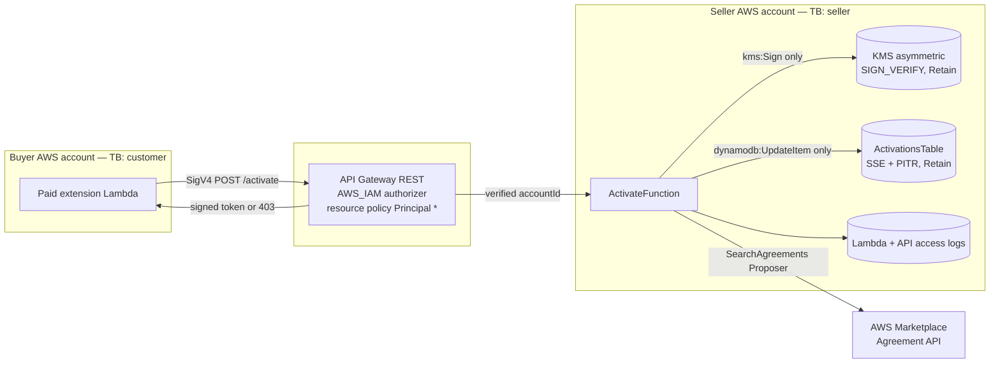

# Seller Entitlement Service — Threat Analysis

## Document Information

| Field | Value |
|-------|-------|
| **Document Version** | 1.0 |
| **Last Updated** | 2026-08-20 |
| **Applies to release** | v0.6.5.dev1 |
| **Feature** | `feature-platform/seller-entitlement-service/` — activation endpoint deployed in an AWS Marketplace **seller** account |
| **Classification** | Internal |

> **New document, and a new trust boundary.** Every other threat doc in this
> repository analyses software running in the **customer's** AWS account, where
> the customer owns the assets and the deployment. This service is the first
> component that runs in the **seller's** account, is reachable by *any* AWS
> principal on the internet, and whose protected assets belong to the seller
> (signing key, customer roster, revenue). Its threats therefore do not fit the
> existing `FEAT.*` model — hence the separate `SELL` prefix.
>
> It is also unusual in the same way PII Anonymization is: the component *is* a
> security control, so most of its threats are about the control failing open,
> failing silently, or being deployed into the wrong place.

## 1. Feature Overview

A paid Feature Platform extension deploys as a CloudFormation stack into the
**buyer's** AWS account. The buyer owns that Lambda, its environment variables,
its IAM role, and its code, which means:

> Software executing in the customer's own AWS account cannot enforce its own
> licence.

The host's entitlement check is therefore **advisory by construction**, and
`FeatureContext.uiAccessAllowed` / `entitlementVerified` are signals to *warn* on,
never to gate on. Enforcement requires the **seller** to hold something the buyer
needs at runtime.

This service is that thing. A buyer's installed extension calls
`POST /activate` with `{"productId": "prod-…"}`, SigV4-signed by its own Lambda
role. The service:

1. reads the caller's **verified** AWS account from `requestContext.identity`
   (API Gateway `AWS_IAM` authorization) — never from the request body;
2. checks entitlement seller-side with
   `SearchAgreements(PartyType=Proposer, AcceptorAccountId=<caller>,
   ResourceIdentifier=<productId>, Status=ACTIVE)`, which only answers for the
   account that **owns** the product;
3. mints a short-lived token signed by a KMS **asymmetric** key, bound to the
   caller's account and carrying a `kid`;
4. records the attempt (granted or refused) in a DynamoDB roster.

It is generic: any AWS partner publishing a Feature Platform extension deploys it
in their own seller account with their own product ids.

## 2. Architecture

**Trust boundaries crossed:** buyer account → internet → seller account, and
seller account → AWS Marketplace. The buyer is **semi-trusted**: authenticated
(SigV4 proves the account) but adversarial with respect to entitlement.

## 3. Threat Analysis

### SELL.T01: Service Deployed Into an Account That Does Not Own the Product

| Attribute | Value |
|-----------|-------|
| **Threat ID** | SELL.T01 |
| **Category** | STRIDE: Denial of Service |
| **Description** | `SearchAgreements(PartyType=Proposer)` answers only for the account that **owns** the product. Deployed into any other account — a dev account, a different seller account of the same organisation — it returns an **empty list rather than an error**, so every activation is refused. |
| **Attack Vector** | Not an attack: operator error. But the failure is the worst shape available — silent, remote, and only visible to paying customers. The service comes up healthy, CloudWatch shows 200s on the API, and the extension simply stops working for everyone. |
| **Impact** | Total outage of the paid extension for every customer, with nothing in the seller's logs explaining why. |
| **Likelihood** | Medium (a seller almost always has several accounts, and credentials are easy to confuse) |
| **Severity** | High (complete loss of function for all paying customers) |
| **Affected Components** | `ActivateFunction`, deployment tooling |
| **Mitigations** | `idp-feature-cli seller-service deploy` runs a **preflight** that refuses to deploy unless the caller's account owns every registered product, verified with `marketplace-catalog:ListEntities`. The check is **ownership-based, not identity-based** — comparing an account id would pass for any seller, including one that does not sell this product. `AccessDenied` on `ListEntities` also **fails** (it nearly always means these are not seller credentials) with `--skip-ownership-check` as a documented, loudly-warned escape hatch. Passing a product *code* where the `prod-…` entity id is required is rejected before any AWS call. 12 unit tests cover the refusal paths; verified live against a real seller account (passes) and a buyer account (refused, exit 1). |
| **Status** | **Mitigated** by the preflight. Residual: `--skip-ownership-check` bypasses it by design. |

### SELL.T02: Spoofed Buyer Identity in the Request Body

| Attribute | Value |
|-----------|-------|
| **Threat ID** | SELL.T02 |
| **Category** | STRIDE: Spoofing, Elevation of Privilege |
| **Description** | The service decides entitlement from *which account is asking*. If that account came from the request body, any AWS principal could claim to be a subscribed account and be issued a valid token for a product they never bought. |
| **Attack Vector** | `POST /activate {"productId": "...", "buyerAccountId": "<a subscribed account>"}` from any AWS account. Subscribed account ids are guessable/discoverable in some contexts, and an attacker can simply try their own partners' accounts. |
| **Impact** | Complete bypass of the commercial gate, and the resulting token is cryptographically valid — indistinguishable from a legitimate one to the extension. |
| **Likelihood** | High if the flaw existed (it is the first thing an attacker would try) |
| **Severity** | Critical |
| **Affected Components** | `_caller_account_id()`, API Gateway authorizer |
| **Mitigations** | The account is read **only** from `requestContext.identity`, which API Gateway populates from the **verified SigV4 signature** before invoking the Lambda; the body is never consulted for identity. `AWS_IAM` authorization means an unsigned request is rejected at the edge with 403. A missing verified identity returns 401 and mints nothing, rather than falling back to anything. Guarded by a dedicated unit test that passes a *conflicting* `buyerAccountId` in the body and asserts the verified value wins, a static template test asserting `DefaultAuthorizer: AWS_IAM` and no `Authorization: NONE`, and a live test asserting an unsigned request is refused. |
| **Status** | **Mitigated.** |

### SELL.T03: Resource-Policy Over-Exposure (`Principal: '*'`)

| Attribute | Value |
|-----------|-------|
| **Threat ID** | SELL.T03 |
| **Category** | STRIDE: Elevation of Privilege |
| **Description** | The API resource policy admits **any** AWS principal, because the seller cannot know buyer account ids in advance. If the policy's `Resource` were wildcarded, that openness would extend to every route the API ever gains — including an administrative one. |
| **Attack Vector** | A future `/admin` or `/meter` route added to the same API inherits `Principal: '*'` if the resource is `execute-api:/*/*`. |
| **Impact** | Depends on the added route; for a metering or admin endpoint it would be severe. |
| **Likelihood** | Low today (one route), rising with every route added |
| **Severity** | High (latent) |
| **Affected Components** | `ActivationApi` resource policy |
| **Mitigations** | The policy is pinned to `execute-api:/*/POST/activate`. A static test asserts exactly one statement, that it names `POST/activate`, and that it does **not** end in a wildcard path — so adding a route does not silently publish it. Note `Principal: '*'` here means "any *authenticated* AWS caller may attempt activation", not anonymous access: an unsigned request never reaches the Lambda. |
| **Status** | **Mitigated** for the current route; **must be re-checked when any route is added** (the static test will fail closed if the policy is widened). |

### SELL.T04: Cost and Quota Exhaustion by an Arbitrary AWS Account

| Attribute | Value |
|-----------|-------|
| **Threat ID** | SELL.T04 |
| **Category** | STRIDE: Denial of Service |
| **Description** | Anyone with an AWS account can call the endpoint. Each request consumes a Marketplace `SearchAgreements` call (a **service quota shared across the seller account**), a Lambda invocation, and — when entitled — a KMS `Sign`. API Gateway throttling is **aggregate at the stage**, not per-caller, so a single attacker sustaining the limit consumes the whole allowance. |
| **Attack Vector** | Sustained signed requests from one or many attacker-controlled AWS accounts. Per-caller throttling is not expressible in a resource policy, and usage-plan API keys cannot be issued to buyers the seller has never met. |
| **Impact** | Legitimate activations throttled → extensions fall back to their grace period and then stop working. Secondary: Marketplace API throttling could affect other seller-side tooling; modest KMS/Lambda cost. |
| **Likelihood** | Low (requires deliberate abuse and an AWS account traceable to the attacker) |
| **Severity** | Medium (degradation, bounded by the buyer-side grace period; no data or key compromise) |
| **Affected Components** | `ActivationApi`, `ActivateFunction`, Marketplace Agreement API quota |
| **Mitigations** | Stage throttling (25 rps / 50 burst) **and a Lambda concurrency reservation** cap blast radius — the reservation matters independently, because without it a flood would consume the seller account's entire Lambda pool and take unrelated seller-side functions down with it — activation is a once-per-TTL-per-install call, so this is generous for legitimate traffic. Every attempt is attributed to a **verified AWS account** in the access log and roster, so abuse is identifiable and actionable (AWS abuse report / block by account). `NotEntitledActivations` and `ActivationAttempt{Outcome=refused}` metrics make a probing pattern visible. The buyer-side **grace period on the last-known-good token** is the control that keeps paying customers working through an outage. Body size is capped at 4 KB before parsing. |
| **Status** | **Partially mitigated / accepted.** No per-caller rate limit exists. Recommended if abuse is ever observed, in order: (1) a WAF rate-based rule on the stage; (2) move repeat abusers to an explicit `Deny` principal list in the resource policy; (3) issue usage-plan API keys to known customers at first activation and require them thereafter. |

### SELL.T05: Signing-Key Compromise or Trust Re-Pointing

| Attribute | Value |
|-----------|-------|
| **Threat ID** | SELL.T05 |
| **Category** | STRIDE: Spoofing, Tampering |
| **Description** | The token signing key is the root of trust for every deployed extension. Whoever can sign with it can mint valid entitlement for any account; whoever can change the key or its policy can re-point that trust. |
| **Attack Vector** | Compromise of the `ActivateFunction` role (e.g. via a dependency or a future code-injection flaw) and use of its KMS grant beyond signing; or destruction of the key, which invalidates all issued tokens. |
| **Impact** | Forged entitlement (revenue loss) or an outage that cannot be repaired by redeploying, since previously-issued tokens become unverifiable. |
| **Likelihood** | Low |
| **Severity** | Critical (root of trust) |
| **Affected Components** | `TokenSigningKey`, `ActivateFunctionRole` |
| **Mitigations** | **Asymmetric** key (`RSA_2048`, `SIGN_VERIFY`): verifiers hold only the public key, so the ability to *verify* is not the ability to *mint* — this is what makes it safe to embed the public key in public-read extension artifacts. The function's grant is **`kms:Sign` only** on that one key — no `PutKeyPolicy`, no `ScheduleKeyDeletion`, and deliberately not even `GetPublicKey` (the operator fetches that with their own credentials). The key policy grants no wildcard principal. `DeletionPolicy: Retain` + `UpdateReplacePolicy: Retain` so a stack delete cannot silently destroy the root of trust. Tokens carry a **`kid`**, so a compromised key can be rotated by standing up a second key and trusting both during the overlap. Static tests assert the key spec, the sign-only grant, the absence of a wildcard principal, and the retain policies. |
| **Status** | **Mitigated.** Residual: KMS cannot auto-rotate a `SIGN_VERIFY` key, so rotation is a manual, `kid`-coordinated procedure that has **not been rehearsed**. Recommend documenting and testing it before the listing converts to paid. |

### SELL.T06: Token Misuse — Replay, Sharing, and Verifier Weakness

| Attribute | Value |
|-----------|-------|
| **Threat ID** | SELL.T06 |
| **Category** | STRIDE: Spoofing, Tampering |
| **Description** | The token is a detached signature over base64 JSON claims. Its security depends on the **verifier** (code in the buyer's account, written by the extension author) checking the right things. Three ways that goes wrong: (a) verifying a *re-serialised* copy of the claims rather than the exact signed bytes; (b) trusting the `signingAlgorithm` field from the response instead of pinning it — the JWT `alg:none` class of bug; (c) not checking `buyerAccountId` and `exp`, making a token portable between customers or usable forever. |
| **Attack Vector** | A customer extracts a valid token from their own deployment and shares it, or an attacker supplies a crafted response to a lax verifier. |
| **Impact** | Entitlement shared beyond the subscribing account, or accepted from an attacker. |
| **Likelihood** | Medium — this is an integration hazard, and the extension author is the one who has to get it right |
| **Severity** | Medium |
| **Affected Components** | Token format; buyer-side verification code |
| **Mitigations** | Claims bind the token to `productId` + `buyerAccountId` and carry `iat`/`exp` with a short TTL, so a shared token is both account-scoped and short-lived. The README's integration contract states explicitly: verify over the **exact base64-decoded bytes**, **pin** `RSASSA_PSS_SHA_256` rather than reading it from the response, and check `buyerAccountId` against the running account and `exp` against the clock. The live test asserts account binding, `kid` presence, a future `exp`, and a real signature verification against the published public key. |
| **Status** | **Mitigated in the protocol; dependent on the verifier.** No `jti`/nonce, so replay *within the TTL by the same account* is possible — accepted, since that account can obtain its own token anyway. Recommend the extension repo implement verification **once** in a shared client rather than per extension. |

### SELL.T07: Product-Existence Oracle

| Attribute | Value |
|-----------|-------|
| **Threat ID** | SELL.T07 |
| **Category** | STRIDE: Information Disclosure |
| **Description** | If an unknown `productId` answered differently from an unentitled one, any AWS account could enumerate which products the seller has registered. That matters most for a listing in **Limited** state, whose `productId` is not public — it would confirm an unreleased product exists. |
| **Attack Vector** | Probe `POST /activate` with candidate product ids and compare responses. |
| **Impact** | Disclosure of unreleased or private product identifiers; competitive/roadmap leakage. |
| **Likelihood** | Low |
| **Severity** | Low |
| **Affected Components** | `handler()` product lookup |
| **Mitigations** | An unknown product returns **the same status and byte-identical body** as "not entitled". The distinction is preserved only in the seller-side log, where it still helps diagnose a legitimate integrator's typo. A unit test compares both responses for equality, and the live test does the same against the deployed stage. |
| **Status** | **Mitigated.** (Was a distinct `404` in the first implementation; changed during security review.) |

### SELL.T08: Unavailability of the Activation Service Locks Out Paying Customers

| Attribute | Value |
|-----------|-------|
| **Threat ID** | SELL.T08 |
| **Category** | STRIDE: Denial of Service |
| **Description** | The service becomes a hard dependency of every deployed paid extension. It **fails closed** on its own errors — an `AccessDenied` or throttle from the Marketplace API is reported as *not entitled*, not as *unknown* — so a seller-side fault would refuse legitimate customers. |
| **Attack Vector** | Seller-side outage, expired/broken IAM, regional Marketplace API issue, or the throttling in SELL.T04. |
| **Impact** | Paying customers lose function through no fault of their own. |
| **Likelihood** | Medium (any long-lived service has outages) |
| **Severity** | High if unmitigated |
| **Affected Components** | `_has_active_agreement()`, buyer-side token cache |
| **Mitigations** | The fail-closed choice is deliberate and is *paired* with a compensating control on the other side: the buyer-side integration is **required** to cache the last-known-good token and apply a **grace period longer than the TTL**, so a seller-side outage is absorbed rather than fatal. This asymmetry is stated in the README as a table (host = advisory allow, this service = deny, extension = grace period) precisely so the three are not "simplified" into agreement. Roster writes are **fail-open** — bookkeeping never causes a refusal. |
| **Status** | **Mitigated by design, contingent on the extension implementing the grace period.** This is the highest-value item to verify in the extension repo. |

### SELL.T09: Customer Roster Disclosure

| Attribute | Value |
|-----------|-------|
| **Threat ID** | SELL.T09 |
| **Category** | STRIDE: Information Disclosure |
| **Description** | The activation roster is a list of the seller's customers — AWS account ids, which products they activated, when, and caller role ARNs — retained indefinitely by design. Read access to it discloses the seller's commercial position; write access could fabricate or erase activation history. |
| **Attack Vector** | Compromise of the `ActivateFunction` role, or over-broad IAM in the seller account. |
| **Impact** | Competitive intelligence (who your customers are); repudiation risk if history can be altered. |
| **Likelihood** | Low |
| **Severity** | Medium |
| **Affected Components** | `ActivationsTable`, `ActivateFunctionRole` |
| **Mitigations** | The function holds **`dynamodb:UpdateItem` only** — it cannot read the roster (so a compromised function is not a way to enumerate the customer list) and cannot delete it. Reads happen out-of-band via `idp-feature-cli seller-service activations` using the operator's own credentials. SSE at rest, point-in-time recovery, and `DeletionPolicy: Retain`. Free-text fields from upstream errors are truncated to 512 bytes. Static tests assert the update-only grant, SSE, PITR and Retain. |
| **Status** | **Mitigated.** Residual: standard seller-account IAM hygiene applies; the roster is only as protected as the account. |

### SELL.T10: Allow-List Bypass Left Enabled in Production

| Attribute | Value |
|-----------|-------|
| **Threat ID** | SELL.T10 |
| **Category** | STRIDE: Elevation of Privilege |
| **Description** | `AllowedAccounts` issues a token **without any subscription check**, for testing the paid path. Every entry is an account receiving the full paid product for free. Left populated after testing, it is a permanent revenue hole — and it is a plaintext CloudFormation parameter, so it is not obvious in review. |
| **Attack Vector** | Operator forgets to clear it; or an insider adds an account. |
| **Impact** | Direct revenue loss, undetectable from the buyer side. |
| **Likelihood** | Medium (classic test-flag-left-on) |
| **Severity** | Medium |
| **Affected Components** | `AllowedAccounts` parameter, `handler()` |
| **Mitigations** | Documented in the parameter description, the README, and the code comment as "every entry here is an account getting your paid product for free — keep it empty in production". Use of the path logs at INFO with the account id and is recorded in the roster with `lastDetail = "allow-listed account"`, so it is visible in `seller-service activations` output rather than invisible. Default is empty. |
| **Status** | **Accepted with detective controls.** Recommend a CI/deploy assertion that `AllowedAccounts` is empty for the production stack, and periodic review of roster rows whose detail is `allow-listed account`. |

## 4. Security Controls Summary

| Control | Implementation | Mitigates |
|---------|---------------|-----------|
| **SigV4-verified caller identity** | API Gateway `AWS_IAM`; account read only from `requestContext.identity` | SELL.T02 |
| **Ownership preflight** | `ListEntities` check before deploy; refuses non-owning accounts | SELL.T01 |
| **Scoped resource policy** | `Principal: '*'` pinned to `POST /activate` | SELL.T03 |
| **Stage throttling** | 25 rps / 50 burst; 4 KB body cap | SELL.T04 |
| **Reserved concurrency** | Caps Lambda fan-out; isolates the rest of the seller account | SELL.T04 |
| **No response caching** | Guarded by a test — a cached decision would outlive a cancellation | SELL.T08 |
| **Asymmetric signing** | KMS `RSA_2048 SIGN_VERIFY`; public key safe to publish | SELL.T05, SELL.T06 |
| **Sign-only key grant** | `kms:Sign` alone; no policy/delete/GetPublicKey | SELL.T05 |
| **Retain policies** | Key + roster survive stack deletion | SELL.T05, SELL.T09 |
| **`kid` in claims** | Enables key rotation with an overlap period | SELL.T05 |
| **Account + TTL binding** | `buyerAccountId`, `iat`, `exp` in signed claims | SELL.T06 |
| **Uniform refusal response** | Unknown product ≡ not entitled, byte-identical | SELL.T07 |
| **Fail-closed here, grace-period there** | Service denies on error; extension caches last-good token | SELL.T08 |
| **Update-only roster grant** | Function cannot read or delete the customer list | SELL.T09 |
| **Roster fail-open** | Bookkeeping failure never causes a refusal | SELL.T08 |
| **Attribution** | Verified account in access log, Lambda log, and roster | SELL.T04, SELL.T10 |
| **Static template tests** | 16 assertions on auth, IAM, key spec, encryption, concurrency, caching; mutation-verified | SELL.T02, T03, T05, T09 |
| **Live activation test** | Unsigned→403, oracle equality, malformed→400, signature verifies | SELL.T02, T06, T07 |

## 5. Open Items

| Item | Threats | Status |
|------|---------|--------|
| No per-caller rate limiting (stage throttle is aggregate) | SELL.T04 | **Accepted** — WAF rate rule / deny-list / usage-plan keys recommended if abuse appears |
| Key rotation procedure not documented or rehearsed | SELL.T05 | **Open** — `kid` makes it possible; do it before the listing converts to paid |
| Buyer-side grace period is a *contract*, not enforced by this service | SELL.T08 | **Open** — must be verified in the extension repo; highest-value follow-up |
| No `jti`/nonce; replay within TTL by the same account | SELL.T06 | **Accepted** — that account can obtain its own token anyway |
| Token verification implemented per-extension | SELL.T06 | **Open** — recommend one shared client in the extension repo |
| `AllowedAccounts` non-empty in production is not machine-checked | SELL.T10 | **Open** — cheap CI/deploy assertion recommended |
| Whether the token gates anything of value | — | **Open, and decisive.** This service is deterrence plus an audit trail; it becomes enforcement only to the extent the token gates something the customer genuinely needs from the seller. A product decision, tracked in the extension repo. |
